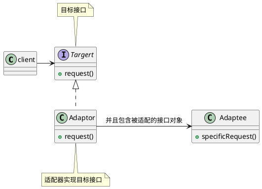
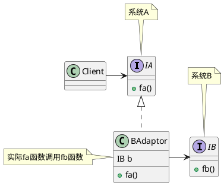

<!--Adapter Design Pattern-->

### 定义

适配器将一个类的接口，转换成客户端期望的另一个接口。适配器让原本不兼容的类达到兼容。

（可以让客户从实现的接口解耦）

> 适配器模式下必须有一个接口的”转换“过程。

> 形象的比喻：USB转接头就是一个适配器！


### 架构




> 上面的是对象适配器的架构，在支持多重继承的语言中，可以使用类适配器：
>
> ```plantuml
> @startuml
> ' 适配器模式
> 
> class client
> 
> interface Targert {
>   + request()
> }
> 
> note top of Targert : 目标接口
> 
> class Adaptor implements Targert,Adaptee {
>     + request()
> }
> 
> class Adaptee {
>   + specificRequest()
> 
> }
> client -> Targert
> 
> 
> @enduml
> ```
>
> 


### 使用场景

一般来说，适配器模式可以看作是一宗“补偿模式”，用来补救设计上的缺陷，也是一种无奈之举。一般也不会优先推荐使用这种模式。

#### 主要场景

**1 封装有缺陷的接口设计**

例如外部引入的接口都是静态方法，会影响代码的可测试性。此时使用适配器进行适配接口，将静态方法都“封装“起来，这样就可以进行测试了。


**2 替换依赖的外部系统**

当需要将外部依赖的一个系统替换成另一个系统的时候，也就是一些系统迁移或者接口切换的场景，使用适配器模式可以减少对代码的改动。




**3 兼容老版本的接口**

在进行一些版本升级的时候，对于一些废弃的接口，我们不会直接删除，而是暂时保留，并且标注为deprecate，并且将内部实现逻辑委托为新的实现逻辑。

例如JDK中包含一个遍历集合容器的类Enumeration，JDK2.0对这个类进行了重构，将它改名为Iterator类，并且对它的代码实现做了优化。但是如果将Enumeration直接从JDK2.0删除，那么那些从JDK1.0升级到JDK2.0的项目，就会编译报错。但是修改散落在各处的Enumeration调用又多又杂，导致升级困难。为了避免这种情况，可以暂时保留Enumeration类，并且将其内部实现替换为Iterator的实现。下面是一个例子：

```java
public class Collections {
    public static Emueration emumeration(final Collection c) {
      return new Enumeration() {
         Iterator i = c.iterator();
        
         public boolean hasMoreElments() {
            return i.hashNext();
         }
        
        public Object nextElement() {
          	return i.next():
        }
       }
    }
}
```


#### 适配器模式在Java日志中的应用

Slf4j这个日志框架相当于JDBC规范，提供了一套打印日志的统一接口规范。但是，它只定义了接口，没有具体的实现，需要配合其他日志框架(log4j、logback、JUL)来使用。Slf4j的出现稍晚于这些框架，为了适配原来的日志框架，Slf4j框架不仅提供可统一的接口定义，还提供了针对不同日志框架的适配器。对不同的日志框架接口进行二次封装，适配成统一的Slf4j接口定义。


### 比较

装饰器和适配器的区别：

装饰器包装一个实现同一个接口的类对象，添加一些责任，并且接口不变；适配器则包装实现不同接口的被适配的对象，进行接口的转换和适配，以达到兼容的效果。


> 实现都差不多，主要还是设计的思想大不同。
>
> 


---

***Reference***:

1. 《Head First 设计模式》
