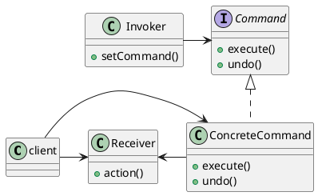

<!--CommandPattern-->

### 定义

命令模式将“请求”封装成对象，以便使用不同的请求、队列或者日志来参数化其他对象。命令模式也可以支持撤销的操作。

> 命令模式主要是将“命令的请求者”从“命令的执行者”对象中解耦。

### 应用场景

- 异步、延迟、排队执行命令、撤销重做命令、存储命令、命令记录日志
- Hystix**熔断**框架就用到了命令模式
- redis使用命令模式处理指令

### 架构

命令模式对象可以包含接受者的引用，也可以不包含，因为在远程调用的情况下，不能获取引用。

---

***Reference***:

