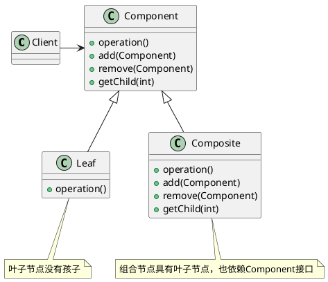

<!--CompositePattern-->

组合模式跟我们之前讲的面向对象设计中的“组合关系(通过组合来组装两个类)”，完全是两码事。这里讲的“组合模式”，主要是用来处理树形结构数据。

### 定义

组合模式允许你将对象组合成树形结构来表示“整体/部分”的层次结构。组合能够让客户以一致的方式处理个别对象以及对象组合。

### 架构

### 使用场景

使用组合模式的前提在于，你的业务场景必须能够表示成树形结构。所以，组合模式的应用场景也比较局限，它并不是一种很常用的设计模式。

> 理解“整体和部分”的关系。

---

***Reference***:

