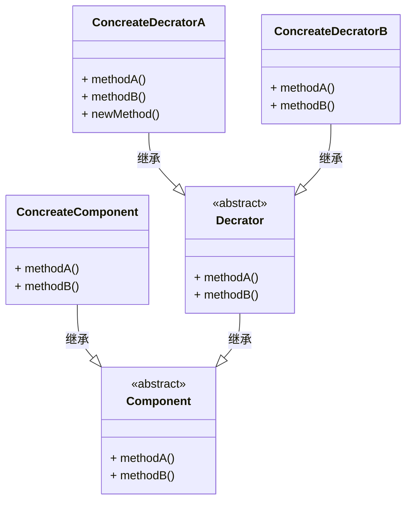

<!--DecoratorPattern-->

### 定义

装饰器模式动态的将责任附加到对象上，若要拓展功能，装饰者提供了比继承更有弹性的替代方案。

### 架构（类图）

装饰的技巧可以在不修改任何底层代码的情况下增强功能。

**Key**：

- 装饰者和被装饰者有相同的超类型

### 使用场景

1. Java IO类库（InputStream、OutputStream）

   > 装饰器模式可以很好的使用韦恩图进行解释，装饰器的包装对象类似于递归调用的形式，一层套一层去调用被包装对象的操作。

   

2. 在不影响其他对象的情况下，以动态、透明的方式给单个对象添加职责。

### 使用缺点

- 使用装饰器模式，常常造成设计中有大量的类。

---

***Reference***:

1. 《Head First 设计模式》
2. [装饰设计（装饰者模式 / 装饰器模式）](https://refactoringguru.cn/design-patterns/decorator)
