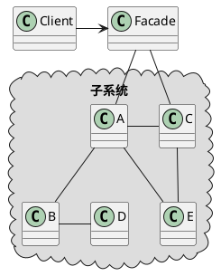

<!--FacadePattern 外观模式也叫做门面模式。-->

### 定义

外观模式定义了一个统一的接口，用来访问子系统中的一群接口。外观定义了一个高层接口，**让子系统更容易使用。**

> 外观模式可以解决接口的复用性和易用性的问题，并且，外观模式可以让层级更加清晰，满足最少知识原则，让暴露的接口或者函数更加少。

### 使用场景

 **1 解决易用性**

当接口越来越多，越来越复杂的时候，提供一层更加简单易用，更加高层的接口。例子：Linux系统调用函数封装了Linux内核调用、Linux的Shell命令封装了复杂的系统调用。

> 单独起起一个API网关层服务做转发和聚合也很类似门面设计模式。

**2 解决性能问题**

将多个接口调用封装成一个简单的门面接口，在一些需要多次请求的网络通信中可以减少通信的次数，降低网络通信的成本，提高APP响应的速度。	

> 经验：
>
> 如果门面接口不多，此时可以将门面接口和原来的接口放在同一个类中，不需要特殊的标记；如果门面接口很多，可以在已有的接口之上，再重新抽象出一层，转门放置门面接口，可以新建一个类或者包；如果门面接口特别多了，并且很多都是跨多个子系统的，可以将门面系统接口放到一个新的子系统中。

**3 解决分布式事务问题**

门面接口可以将一个事务的多个接口封装在一个接口中，方面进行事务的回滚或者重试。

### 架构

### 比较

- 适配器是做接口转换，解决的是原接口和目标接口不匹配的问题。门面模式做接口整合，解决的是多接口调用带来的问题。
- 适配器模式注重的是兼容性，而门面模式注重的是易用性。

---

***Reference***:

