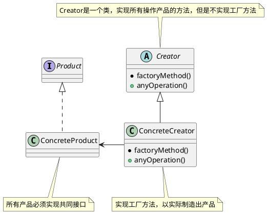
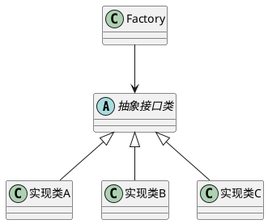
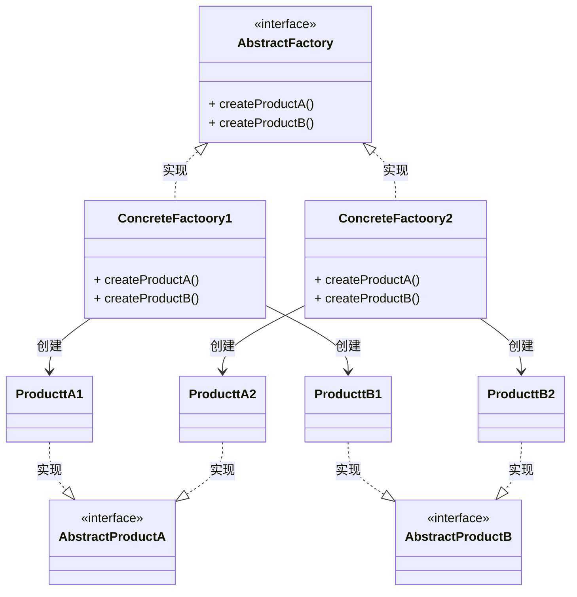
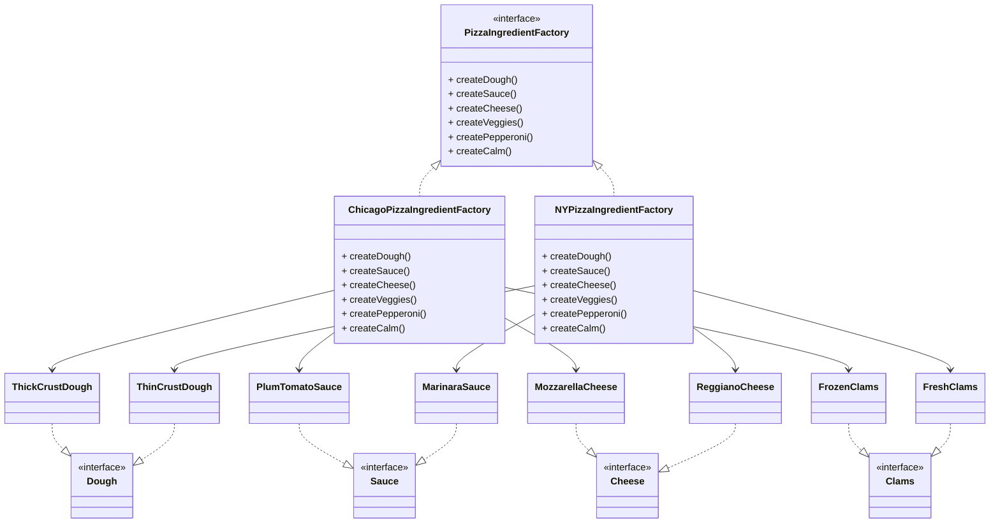

> 当我们使用new创建一个对象的时候，需要指定一个具体类，这就是针对实现进行编程。当我们将创建对象的过程封装成一个方法或者接口的时候，就可以避免针对实现编程，变成针对接口编程。

针对接口编程，可以隔离掉以后系统可能发生的一大堆改变。为什么呢？

1. 通过多态，可以让任何实现类实现改接口。
2. 然后替换掉你原来的实现。

> 对拓展开放，对修改关闭。

### 定义

工厂方法模式定义了一个创建对象的接口，但由子类决定要实例化的类是哪一个。工厂方法将实例化推迟到子类。

> 核心在将创建对象的过程解耦出来。

### 架构

工厂模式体现了一个原则：依赖倒置原则。（Spring叫依赖反转）

> 原来依赖具体类，现在依赖一个抽象的接口。

Key:

- 工厂只有一个功能——创建指定的类。（单一职责）
- 将原来的if-else判断，转换成对象进行处理。
- 抽象成一个方法 -》 抽象成一个类 -〉 抽象成一个接口

### 抽象工厂模式

定义：抽象工厂模式提供一个接口，用于创建相关或者依赖对象的家族，而不需要明确指定具体类。

架构：

抽象工厂模式类似于一个二维的分类，将更加复杂的系统进行整理并且划分。以达到解耦的效果。

一个披萨商店的例子，可以很清晰的解释这种架构：

工厂方法就隐含在抽象工厂里面。

### 问题

1. 什么是静态工厂方法，和静态工厂有什么区别？

   静态工厂方法有不需要创建对象就能够调用静态方法的优势，但是缺点是不能通过继承来改变创建的方法。

---

***Reference***:

1. [Factory Design Pattern in Java - JournalDev](https://www.journaldev.com/1392/factory-design-pattern-in-java)
