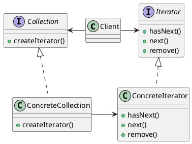

> 迭代器模式也叫游标模式。

<!--IteratorPattern-->

### 定义

迭代器模式提供了一种方法顺序访问一个聚合对象中的各个元素，而不暴露其内部的表示。

> 迭代器模式封装了遍历。并且迭代器模式还将在元素之间进行游走的责任交给迭代器，使得职责更加单一。

### 架构

### 使用场景

- Java Iterator
- 解耦容器代码和遍历代码，使得职责更加单一

### 问题

1. Java中如果使用迭代器的同时删除容器中的元素，会导致迭代器的错误，这是为什么？如何解决呢？

   不只是删除容器，增加元素也可能会出现问题。

   在使用迭代器遍历到后面的元素时，删除了前面的元素，会导致遍历元素少了一个。(2被跳过了)

   

   在使用迭代器遍历到后面的元素时，在前面增加了元素，会导致前面遍历的一个元素又遍历了一次。（1重复遍历了）

   

   如何解决？

   Java语言中的解决方法是增删元素之后，让遍历报错。

   > 在 ArrayList 中定义一个成员变量 modCount，记录集合被修改的次数，集合每调用一次增加或删除元素的函数，就会给 modCount 加 1。当通过调用集合上的 iterator() 函数来创建迭代器的时候，我们把 modCount 值传递给迭代器的 expectedModCount 成员变量，之后每次调用迭代器上的 hasNext()、next()、currentItem() 函数，我们都会检查集合上的 modCount 是否等于 expectedModCount，也就是看，在创建完迭代器之后，modCount 是否改变过。

   如果两个值不相同，那就说明集合存储的元素已经改变了，要么增加了元素，要么删除了元 素，之前创建的迭代器已经不能正确运行了，直接抛出错误让程序员解决。

   迭代器内部也实现了一个remove() 方法，能够在遍历集合的同时，安全地删除集合中的元素。它作用有限，**只能删除游标指向的前一个元素**，而且一个 next() 函数之后，只能跟着最多一个 remove() 操 作，多次调用 remove() 操作会报错。

### 区别和关系

- 你可以使用[迭代器模式](https://refactoringguru.cn/design-patterns/iterator)来遍历[组合模式](https://refactoringguru.cn/design-patterns/composite)树。

---

***Reference***:

