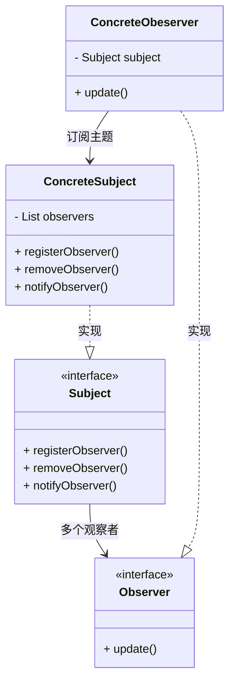

<!--ObserverPattern-->

### 定义

观察者模式定义了对象之间的**一对多**依赖，这样一来，当一个对象改变状态时，它的所有依赖者都会收到通知并且自动更新。

> 一个比喻：报纸订阅（出版者和订阅者）

### 架构

观察者依赖主题。观察者模式提供了一种对象设计，让主题和观察者之间松耦合。他们依然可以交互，但是不必清楚彼此的细节。

主题主动推数据和观察者自己拉数据都可以，但是关键在于主题必须得通知观察者。

Q & A：

- 为什么观察者要包含一个主题（subject）的引用？

  以后可能需要取消注册，保存一个引用会更加方便。

- “生产者-消费者”模型和观察者模式的区别和联系？

  生产-消费模型，是多对多的关系，一般以异步的方式实现；而观察者模式（发布-订阅模型），是一对多的关系，可以以同步的方式实现，也可以以异步的方式实现。

  > 发布订阅和生产消费模型最大的区别在于：发布者（可观测对象）是知道订阅者（观察对象）的存在，因为它需要遍历订阅列表去发布事件；而生产消费模型因为有中间消息代理的存在，生产者和消费者完全不知道对方的存在，完全解耦！

### Java内置的观察者模式

java.util包下的Observable和Observer。

### Google EventBus

异步非阻塞观察者模式的实现。

简单的实现方法：

1. 在可观察对象了里面对各个观察者的通知改成异步操作。（可用线程池）
2. 在观察者内部的处理消息改为异步操作。（不可用线程池）

> 两者都能够开启线程去跑，很快就返回，不阻塞。

针对异步非阻塞观察者模式的实现，抽象的EventBus框架可以让我们聚焦于业务。

### 使用场景

1. 消息队列
2. 回调就是一种观察者模式
3. Google EventBus
4. 邮件订阅
5. RSS
6. 反应式RxJava
7. JDK(CompletableFuture)

---

***Reference***:

1. 极客时间-观察者模式
2. [观察者设计模式](https://refactoringguru.cn/design-patterns/observer)
