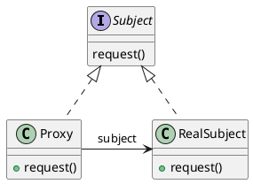

### 定义

代理模式为另一个对象提供一个替身或者占位符以控制这个对象的访问。

### 框架

### 使用场景

代理的几种模式：

- 远程代理：远程代理可以作为另一个JVM上对象的本地代表。常见的是RPC框架。
- 虚拟代理：虚拟代理作为创建开销大的对象的代表。当对象没有得到的情况下执行一些操作。常见的是图片的加载。
- 缓存代理：缓存代理会维护之前的对象，在可能的情况下会返回缓存对象。
- 保护代理：可以根据客户的角色来决定是否允许客户访问特定的方法。（Java动态代理）

其他代理：

- 防火墙代理：控制网络资源的访问，保护访问坏网络。
- 智能引用代理：例如计算一个对象被引用的次数。
- 同步代理：在多线程的情况下为主题提供安全的访问。
- 写入时复制代理：用于控制对象的复制，方法是延迟对象的复制，发那个客户真的需要（也就是需要写入时）才进行复制。是虚拟代理的变体。（Java5的CopyOnWriteArrayList）

### 区别

- 装饰器模式是为对象增加行为，而代理模式是控制对象的访问。
- 适配器会改变对象适配的接口，而代理则实现相同的接口。

---

***Reference***:

