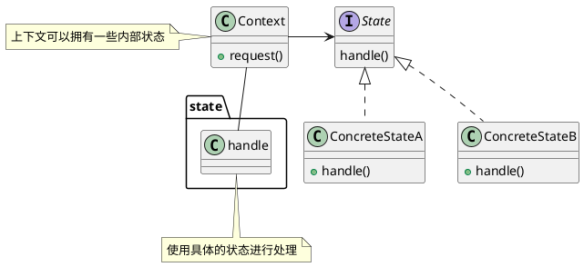

### 定义

状态模式允许对象在内部状态发生改变时改变它的行为。（对象看起来好像改变了它的类）

### 架构

### 实现方法

实现状态机的三种方法：

1. 分支逻辑法
2. 查表法
3. 状态模式

> 实际上，像游戏这种比较复杂的状态机，包含的状态比较多，我优先推荐使用查表法，而状态模式会引入非常多的状态类，会导致代码比较难维护。相反，像电商下单、外卖下单这种类型的状态机，它们的状态并不多，状态转移也比较简单，但事件触发执行的动作包含的业务逻辑可能会比较复杂，所以，更加推荐使用状态模式来实现。

### 使用场景

状态模式一般用来实现状态机，而状态机常用在**游戏、工作流引擎等系统开发**中。或者在一些单据的流转上也可以使用状态模式。

状态模式的要求就是这些状态都必须是可以预知的，并且状态之间的流转关系清晰，没有不确定性。可以称之为更高级的“if-else”。

### 区别

状态模式和策略模式的区别：

- 状态模式可以随着时间改变状态，从而执行不同的行为；但是策略模式是事先准备好多种策略，在开始的时候选择了一种策略就是一直使用这种策略进行处理。（可以说，状态模式运行时使用了所有的状态，而策略模式在运行时只使用了一种策略）

---

***Reference***:

1. 《Head First设计模式》
