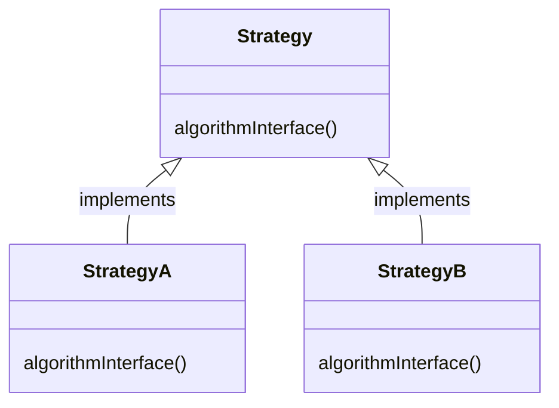
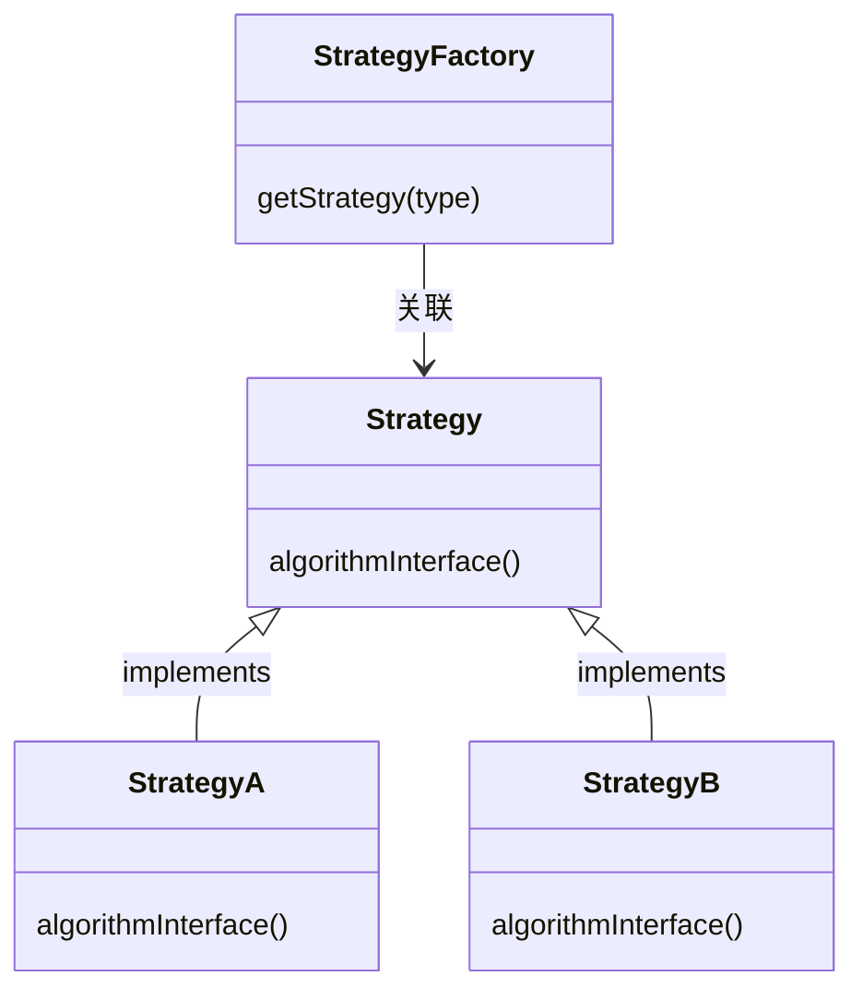
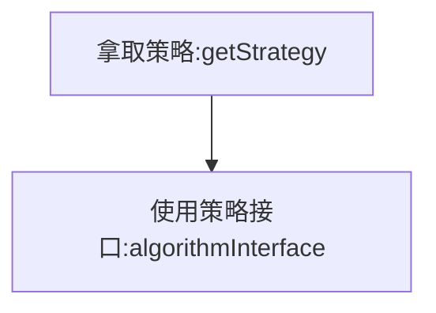

使用场景

1. 避免冗长的if-else或switch分支判断
2. 提供框架的扩展点

策略模式：

策略模式定义了算法族，分别封装起来，让他们之间可以互相替换。**此模式让算法的变化独立于使用算法的客户**。

策略定义：

策略创建：

- 无状态策略：无状态的策略因为不会变，可以进行缓存，一开始就创建好所有的策略即可。（直接从map中拿取）
- 有状态策略：有状态的策略因为会改变，所以每次创建都需要是一个最新的策略对象。（在工厂类中存在if-else判断）

策略使用：

​	

1. 从工厂类中拿取策略。
2. 调用策略对应的接口函数。

对于Java来说，可以使用反射来避免策略工厂类的修改。（配置文件或者annotation）

> Spring框架中有org.springframework.beans.factory.ListableBeanFactory#getBeansOfType(java.lang.Class<T>)函数可以直接获取指定类型的Bean，通常这个类型可以设置成策略的接口。

策略模式主要是解耦策略的定义、创建和使用，并且还能满足开闭原则，方便后面进行拓展。

解决什么问题使用策略模式？

- 告警
- 重试
- 规则配置（规则引擎）

什么情况下有必要去除if-else或者switch-case分支语句？

- 业务逻辑过于复杂，后续需求不断来。（KISS原则）

---

***Reference:***

1. 极客时间《使用策略模式除去if-else分支逻辑》
