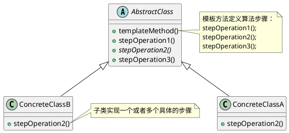

<!--TemplateMethodPattern-->

### 定义

模板方法模式在一个方法中定义一个算法的架构，而将一些步骤延迟到子类中。模板方法使得子类可以在不改变算法结构的情况下，重新定义算法中的某些步骤。

> 模板方法模式体现了好莱坞原则：别调用我们，我们会调用你。简单的说，模板方法的抽象类会告诉子类，你不要调用我们，我们会调用你。

### 使用场景

模板方法模式还可以在抽象类中定义一个什么都不做的函数步骤，子类根据情况考虑是否实现这个接口，而这个接口就是一个钩子，可以在模板步骤的指定位置做一些事。

Java中的排序算法也是一种模板方法，排序的列表元素类型需要实现compareTo方法，这就类似模板方法里面的一个步骤。实现了之后，才能完成排序的过程。


**1 复用**

因为模板方法是基于继承实现，可以将固定的算法步骤封装在抽象类，抽象类可以实现一些固定的步骤，子类直接进行复用就可以了。

例子：Java中的InputStream的read()函数(子类实现参数不同的read函数)和AbstractList的addAll()函数(子类实现add函数)。

**2 框架拓展性**

- HttpServlet的service()方法就是一个模板方法，它实现了整个http请求的执行流程，而doGet()和doPost()是模板中可以由子类自定义的部分。相当于框架为用户提供了拓展点，使得不需要修改框架源码就能将拓展点添加到框架中。
- Junit框架也提供了一些功能拓展点setUp()和setDown()，可以在开始和结束的时候做一些事情，而runBase()函数是一个模板方法，定义了执行测试用例的整体流程。

### 架构



模板方法可以配合范型进行使用：

```java
public class AbstractService<T, L> {
  
  protected abstract T getData(int x);
  public void calAndSaveTransaction(T t,L l);
}

public ConcreteService implements AbstractService<String, Integer> {
  ...
}
```

### 区别

- 策略模式和模板方法模式都封装算法，但是一个组合，一个继承。
- 工厂方法是模板方法的一个特殊版本。


---

***Reference***:

