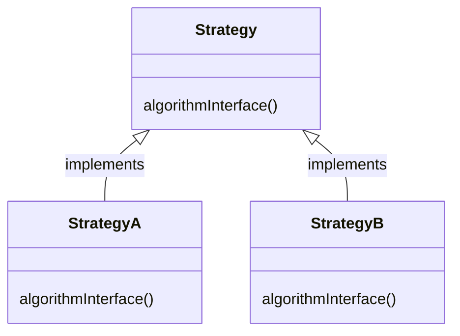

# HED 1

11111111111111

# HED2

2222222222222

3222222

------

> I am a man

- [https://zenn.dev/eetann/articles/2022-08-15-notion-api-with-github-actions](https://zenn.dev/eetann/articles/2022-08-15-notion-api-with-github-actions)

