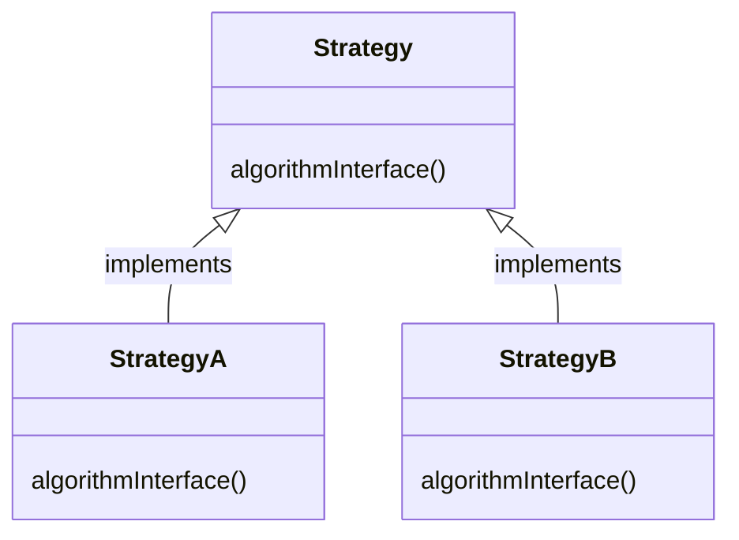

# HED 1

 

<div style="width: 100%; max-width: 850px; margin-top: 4px; margin-bottom: 4px;">
    <div style="display: flex;">
        <div style="display: flex; width: 100%; border-radius: 3px; background: rgb(241, 241, 239); padding: 16px 16px 16px 12px;">
            <div>
                <div style="user-select: none; transition: background 20ms ease-in 0s; display: flex; align-items: center; justify-content: center; height: 24px; width: 24px; border-radius: 3px; flex-shrink: 0;">
                    <div style="display: flex; align-items: center; justify-content: center; height: 24px; width: 24px;"><div style="height: 16.8px; width: 16.8px; font-size: 16.8px; line-height: 1.1; margin-left: 0px; color: black;">💡</div></div>
                </div>
            </div>
            <div style="display: flex; flex-direction: column; min-width: 0px; margin-left: 8px; width: 100%;">
                <div style="max-width: 100%; width: 100%; white-space: pre-wrap; word-break: break-word; caret-color: rgb(55, 53, 47); padding-left: 2px; padding-right: 2px;"><p>test</p></div>
            </div>
        </div>
    </div>
</div>

11111111111111


# HED2

2222222222222


<font color=yellow_background>3222222</font>


------


> I am a man





- [https://zenn.dev/eetann/articles/2022-08-15-notion-api-with-github-actions](https://zenn.dev/eetann/articles/2022-08-15-notion-api-with-github-actions)


```plain text
sdasdjasdasda
```


