<!--在HUGO博客使用plantUML的方法：直接：```plantuml 你的代码 ```就能用了-->


### 类图绘制

> 参考：[【程序员小知识】使用 PlantUML 画 UML（上）类图 - 掘金](https://juejin.cn/post/7012797326083227661)

一览：


> 需要注意，一组`@startuml/@enduml` 对应一张 png，如果一个文件中有多组，则生成的 png 文件名会添加自增数字后缀。 此外也可以紧跟在 `@startuml` 之后指定文件名：
>
> ```
> @startuml foo
> class Foo
> @enduml
> 
> @startuml bar
> class Bar
> @enduml
> 
> @startuml baz
> class Baz
> @enduml
> ```
>


#### 注释

```
' 这是注释
```

可以使用 `note left of` , `note right of` , `note top of` , `note bottom of` 等关键字定义相对于对象位置的注释。

#### 标题

```
' 标题为Hello Title
title Hello Title
```

#### 图注

```
caption 图１
```

#### 脚注

```
footer World
```

#### 放大率

```
@startuml scale-1.5
scale 1.5
Hello <|-- World
@enduml
```

#### 定义常见结构

```
' 定义类hello
class Hello

' 定义接口hello
interface Hello

' 定义抽象类hello
abstract Hello

' 定义枚举
enum HelloWorld {
    ONE
    TWO
    THREE
}
```

```plantuml
@startuml
' 定义类hello
class Hello

' 定义æ¥å£hello
interface Hello

' 定义抽象类hello
abstract Hello

' 定义æšä¸¾
enum HelloWorld {
    ONE
    TWO
    THREE
}
@enduml
```


UML中类型之间有六大关系：

- 泛化（Generalization）
- 实现（Realization）
- 关联（Association)
- 聚合（Aggregation）
- 组合(Composition)
- 依赖(Dependency)

#### 泛化（继承）

> `<|--` `--|>` 指定继承关系

```
@startuml
Child --|> Parent
Parent2 <|-- Child2
@enduml
```

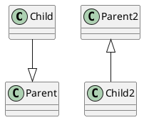

使用`extends` 关键字也可以

#### 实现

> `..|>`, `<|..` ， 圆点表示虚线

```
@startuml
Plane ..|> Flyable
Flyable <|.. Plane
@enduml
```

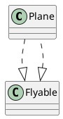

使用`implements` 关键字也可以。

#### 依赖

```
@startuml
Chef ..> Recipe
@enduml
```

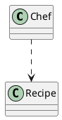

> 依赖表示使用关系，java中, 被依赖的对象/类, 以方法参数, 局部变量和静态方法调用的形式出现。比如, 厨师在烹饪的时候看了一眼菜谱, 厨师"使用"了菜谱, 照着它炒完菜后，这种使用关系就结束了(临时性).


#### 关联

> 关联关系，表示"拥有"。 相比依赖关系的临时性和单向性，关联关系具有长期性、平等性(可双向)，所以关联表示的关系比依赖更强。比如现实生活中的夫妻, 师生等关系。长期存在并且是相互的关系。 此外关联可以表示一对一，一对多，多对一，多对多等各种关系。

```
@startuml
Address <-- Husband
Husband <--> Wife
Husband2 -- Wife2
@enduml
```

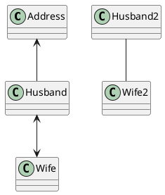


#### 聚合

> 聚合关系相对于组合弱一些，整体与部分是可分离的。 比如部门与员工，部门有许多员工，员工离职了部门仍然存在，不受影响。反之部门解散了，员工可以去其他部门(整体与部分可分离)

```
@startuml
Department o-- Employee
@enduml
```

`o` 表示空心菱形

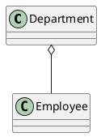

#### 组合

> 组合关系中，整体与部分是不可分离的，整体与部分的生命周期保持一致，少了对方自己的存在无意义。例如人体是有四肢组成的，四肢不能脱离人体存在，人体少了四肢也难言完整。

```
@startuml
Body "1" *-- "2" Arm
Body "1" *-- "2" Leg
@enduml
```

`*` 表示实心菱形

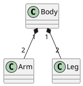


#### 抽象方法和静态方法

```
@startuml
class Hello {
    {abstract} one: int
    {abstract} two(): int
}
@enduml


@startuml
class Hello {
    {static} ONE: int
    {static} two(): int
}
@enduml
```

```plantuml
@startuml
class Hello {
    {abstract} one: int
    {abstract} two(): int
}
@enduml


@startuml
class Hello {
    {static} ONE: int
    {static} two(): int
}
@enduml
```


#### 泛型

```
@startuml
class Hello<H>
class World<W> 
@enduml
```

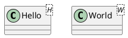


#### 包图

```
@startuml
package one.two {
    class Hello
}

package three.four {
    World -- Hello
}
@enduml
```

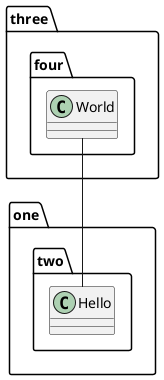


### 时序图

> 序列图是仅次于类图的最常用 UML 图。 序列图将交互关系表示为一个二维图，纵向是时间轴，时间沿竖线向下延伸；横向轴代表了在协作中各个角色，一般是一个 Class 的对象，用一条虚线代表各角色的生命线，生命线上用矩形竖条表示是否处于活跃状态。对象之间可以发送同步或异步消息。

序列图的基本内容构成：

 `<角色> <消息类型> <角色> : <消息内容>`

- 消息类型中 `->` 表示同步消息
- `-->` 虚线表示返回消息

#### 同步消息

```
@startuml
Alice -> Bob: Hi
Bob --> Alice: Hi

Alice -> Bob: Is this a pen?
Bob --> Alice: No! This is an apple!!
@enduml
```

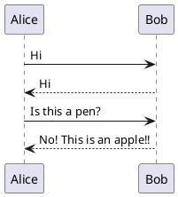


#### 异步消息

```
@startuml
Alice ->> Bob: Hi
Alice ->> Bob: Is this a pen?
Alice ->> Bob: Is this a pen??
Alice ->> Bob: Is this a pen???
Alice ->> Bob: Is this a pen????

Bob -> Alice: This is an apple!!!
@enduml
```


#### 角色生命线

- 多个`participant` 会按照从左往右的顺序显示各角色生命线
- 如果没有任何 `participant`, 则会角色出现的顺序显示从左往右显示其生命线


#### 角色图例

```
@startuml
actor Actor
boundary Boundary
control Control
entity Entity
database Database
collections Collections
@enduml
```

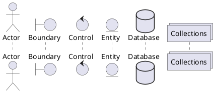


#### 箭头样式

```
@startuml
Bob ->x Alice
Bob -> Alice
Bob ->> Alice
Bob -\ Alice
Bob \\- Alice
Bob //-- Alice

Bob ->o Alice
Bob o\\-- Alice

Bob <-> Alice
Bob <->o Alice
@enduml
```

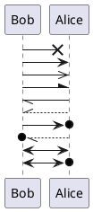


#### 发给自己的消息

```
@startuml
Aclie -> Aclie: do something by yourself
Aclie -> Aclie: do something by yourself
Aclie -> Aclie: do something by yourself
Aclie -> Aclie: do something by yourself
@enduml
```

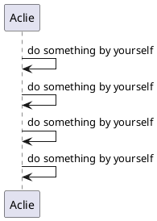


#### 消息序号

添加关键字`autonumber`

````
@startuml
Alice -> Bob: Hi
autonumber
Bob -> Carol: Hi
Carol -> Dave: Hi
Bob -> Dave: Hi
@enduml
````

- autonumber stop: 自动序号暂停
- autonumber resume: 自动序号继续

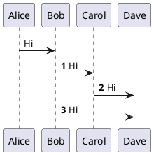


#### 消息组

```
  @startuml
  Alice -> Bob: Is this a pen?
  alt yes
      Alice <-- Bob: Yes! This is a pen!!
  else no
      Alice <-- Bob: No! This is an apple!!!!!
  end
  @enduml
```

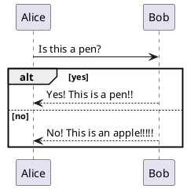


有时候需要多个消息表示一组相关的逻辑，此时可以使用预置的关键字来表示各种逻辑，例如

- alt/else
- opt
- loop
- par
- break
- critical

关键词之后添加表示逻辑的文字，例如 yes， no等

消息信息的缩进不是必须的，但是加上可读性更好

**消息组嵌套**

```
@startuml
Alice -> Bob: Is this a pen?
alt yes
    Alice <-- Bob: Yes! This is a pen!!
else no
    Alice <-- Bob: Noooooooo! This is an apple!!!!!
    loop ∞
        Alice -> Bob: Oh sorry! By the way, is this a pen?
        Alice <-- Bob: No!!!!
    end
end
@enduml
```

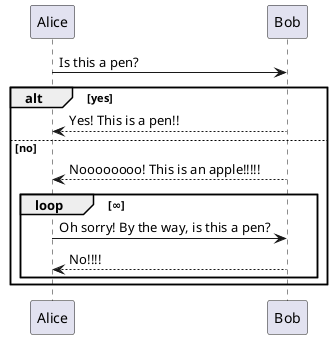


**自定义消息组**

```
@startuml
group copy
    Alice -> Bob: Is this a pen?
    Alice <-- Bob: No! This is an apple!!
end
@enduml
```

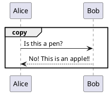

`group` 之后添加消息组的名字


#### 生命线活跃状态

- `activate <name>` 指定name的生命线进入活跃状态
- `deactive <name>` 指定name的生命线退出活跃状态

```
@startuml
activate Alice
Alice -> Bob

activate Bob
Bob -> Carol

activate Carol
Bob <-- Carol

deactivate Carol
Alice <-- Bob

deactivate Bob
@enduml

```

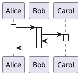


#### 嵌套活跃状态

```
@startuml
activate Alice
Alice -> Bob

activate Bob
Bob -> Bob
activate Bob
Bob -> Carol

activate Carol
Bob <-- Carol

deactivate Carol
Alice <-- Bob

deactivate Bob
@enduml
```

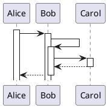

​	`activate` 中继续 `activate` 可以嵌套活跃状态


#### 	创建角色和生命线

```
@startuml
Alice -> Bob
create Carol
Bob -> Carol: new
Bob -> Carol
Bob <-- Carol
Alice <-- Bob
@enduml
```

`````plantuml
@startuml
Alice -> Bob
create Carol
Bob -> Carol: new
Bob -> Carol
Bob <-- Carol
Alice <-- Bob
@enduml
`````

`create <name>` 用来创建一个角色和其生命线，此时消息箭头会执行角色图例


#### 参考、引用

```
@startuml
Alice -> Bob
ref over Bob, Carol: ...
Alice <-- Bob
ref over Alice
...
...
end ref
@enduml
```

- `ref over <生命线名称> : <内容>` : reference 的范围和参考内容
- `ref over ... end ref`: 可以换行写参考内容

```plantuml
@startuml
Alice -> Bob
ref over Bob, Carol: ...
Alice <-- Bob
ref over Alice
...
...
end ref
@enduml
```


#### 边界线

```
@startuml
== Foo ==
Alice -> Bob
Alice <-- Bob

== Bar ==
Bob -> Carol
Bob <-- Carol
@enduml
```

`== <name> ==` 添加边界线，跨越所有角色的生命线

```plantuml
@startuml
== Foo ==
Alice -> Bob
Alice <-- Bob

== Bar ==
Bob -> Carol
Bob <-- Carol
@enduml
```


#### 外部消息

```
@startuml
[-> Alice: Hello
Alice ->]: Hello
@enduml
```

消息箭头的前后使用 `[` ， `]` ，表示一个来自外部或者指向外部的消息

```plantuml
@startuml
[-> Alice: Hello
Alice ->]: Hello
@enduml
```


#### 消息间隔

```
@startuml
Alice -> Bob
Alice <-- Bob

Alice -> Bob
Alice <-- Bob
|||
Alice -> Bob
Alice <-- Bob
||80||
Alice -> Bob
Alice <-- Bob
@enduml

```

- 消息之间加 `|||` , 会适当拉开消息间隔
- `||<pixel>||`：pixel可以指定具体间隔的像素数

```plantuml
@startuml
Alice -> Bob
Alice <-- Bob

Alice -> Bob
Alice <-- Bob
|||
Alice -> Bob
Alice <-- Bob
||80||
Alice -> Bob
Alice <-- Bob
@enduml
```


#### 备注

```
@startuml
Alice -> Bob
note left: Hello
Alice <-- Bob
note right: World
Alice -> Alice
note left
Hello
World
end note
@enduml
```

```plantuml
@startuml
Alice -> Bob
note left: Hello
Alice <-- Bob
note right: World
Alice -> Alice
note left
Hello
World
end note
@enduml
```

### 组件&部署图

#### 箭头方向

`->`表示向右，	`-->`表示向下。还可以使用关键字`left`, `right`, `up` or `down`改变箭头方向。`-left->`或`-l->`表示向左。

```
@startuml
component componentA as A
component componentB as B

component componentC as C
component componentD as D
' 表示箭头向右
A -> B
' 表示箭头向下
C --> D
@enduml
```

```
@startuml
component componentA as A
component componentB as B

component componentC as C
component componentD as D
' 表示箭头向右
A -> B
' 表示箭头向下
C --> D
@enduml
```

还有虚线(`..`)、直线(`--`)

#### 组件

关键字`component`定义一个组件。	

```
@startuml
component componentA as A
component componentB as B

component componentGroup as group {
  component componentC as C
  component componentD as D
}
@enduml
```

```plantuml
@startuml
component componentA as A
component componentB as B

component componentGroup as group {
  component componentC as C
  component componentD as D
}
@enduml
```

#### 接口

接口可以使用`()`来定义，也可以使用关键字`interface`来定义接口。

```
@startuml
() "interfaceA" as iA
interface interfaceB as iB
@enduml
```

```plantuml
@startuml
() "interfaceA" as iA
interface interfaceB as iB
@enduml
```


#### 组合组件

可以使用多个关键字将组件和接口组合在一起。

- `package`
- `node`
- `folder`
- `frame`
- `cloud`
- `database`

```
@startuml
package "Some Group" {
  HTTP - [First Component]
  [Another Component]
}

node "Other Groups" {
  FTP - [Second Component]
  [First Component] --> FTP
}

cloud {
  [Example 1]
}


database "MySql" {
  folder "This is my folder" {
    [Folder 3]
  }
  frame "Foo" {
    [Frame 4]
  }
}


[Another Component] --> [Example 1]
[Example 1] --> [Folder 3]
[Folder 3] --> [Frame 4]
@enduml
```

```plantuml
@startuml
package "Some Group" {
  HTTP - [First Component]
  [Another Component]
}

node "Other Groups" {
  FTP - [Second Component]
  [First Component] --> FTP
}

cloud {
  [Example 1]
}


database "MySql" {
  folder "This is my folder" {
    [Folder 3]
  }
  frame "Foo" {
    [Frame 4]
  }
}


[Another Component] --> [Example 1]
[Example 1] --> [Folder 3]
[Folder 3] --> [Frame 4]
@enduml
```

#### 长描述

可以用方括号"[ ]"在连线上添加描述。

```
@startuml
component comp1 [
This component
has a long comment
on several lines
]
@enduml
```

```plantuml
@startuml
component comp1 [
This component
has a long comment
on several lines
]
@enduml
```


#### 颜色

在声明一个组件时加上颜色的声明，在后面加上`#颜色名`可以改变颜色/

```
@startuml
component [Web Server] #yellow
@enduml
```

```plantuml
@startuml
component [Web Server] #yellow
@enduml
```


---

#### 声明元素

```
@startuml

actor actor
actor/ "actor/"
agent agent
artifact artifact
boundary boundary
card card
circle circle
cloud cloud
collections collections
component component
control control
database database
entity entity
file file
folder folder
frame frame
interface interface
label label
node node
package package
queue queue
rectangle rectangle
stack stack
storage storage
usecase usecase
usecase/ "usecase/"
@enduml
```

```plantuml
@startuml

actor actor
actor/ "actor/"
agent agent
artifact artifact
boundary boundary
card card
circle circle
cloud cloud
collections collections
component component
control control
database database
entity entity
file file
folder folder
frame frame
interface interface
label label
node node
package package
queue queue
rectangle rectangle
stack stack
storage storage
usecase usecase
usecase/ "usecase/"

@enduml
```


#### 分隔符

```
@startuml
folder folder [
这是个 <b>文件夹
----
您可以使用
====
不同类型
....
的分隔符
]

node node [
这是个 <b>结点
----
您可以使用
====
不同类型
....
的分隔符
]

database database [
这是个 <b>数据库
----
您可以使用
====
不同类型
....
的分隔符
]

usecase usecase [
这是个 <b>用例
----
您可以使用
====
不同类型
....
的分隔符
]

@enduml
```

```plantuml
@startuml
folder folder [
这是个 <b>文件夹
----
您可以使用
====
不同类型
....
的分隔符
]

node node [
这是个 <b>结点
----
您可以使用
====
不同类型
....
的分隔符
]

database database [
这是个 <b>数据库
----
您可以使用
====
不同类型
....
的分隔符
]

usecase usecase [
这是个 <b>用例
----
您可以使用
====
不同类型
....
的分隔符
]

@enduml
```


#### 隐藏线

`-[hidden]-`可以画一条隐藏的线条，常常用于布局。


### 相关配置

#### 安装graphviz

Mac执行：

```
brew install graphviz
```

然后在IDEA进行设置。


---

***Reference***:

- [开源工具，使用简单的文字描述画UML图。](https://plantuml.com/zh/)
- [程序员必备画图技能之——时序图 - 程序员自由之路 - 博客园](https://www.cnblogs.com/54chensongxia/p/13236965.html)
- [【程序员小知识】使用 PlantUML 画 UML（上）类图 - 掘金](https://juejin.cn/post/7012797326083227661)
- [在 Hugo 博客上使用 PlantUML – Mogeko's Blog](https://mogeko.me/posts/zh-cn/083/)


