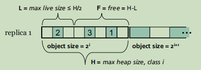
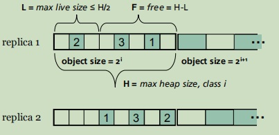

# DieHard

一个基于概率内存安全的运行时系统。

## 基本介绍


源码：https://github.com/emeryberger/DieHard

## 支持

- Windows
- Linux
- Mac OS X

## 安装

> 需要C++14支持

1. 解压并且进入文件夹

   ```bash
   unzip DieHard.zip
   cd DieHard
   ```

2. 编译

   ```bash
   cd src/
   TARGET=libdiehard make linux-gcc-x86-64-replicated
   TARGET=libdieharder make linux-gcc-x86-64-replicated
   ```

   编译完成在目录下会新增3个动态链接库：libdieharder.so和libdiehard.so、libdieharder_r.so

   ```bash
   cd src/util/
   g++ -pipe -g -fPIC -I. -I.. -I../../src/archipelago/brokenmalloc -D_REENTRANT=1 -shared libbrokenmalloc.cpp -o libbrokenmalloc.so -ldl
   g++ -fPIC -pipe -g -I. -I.. -I../../src/archipelago/brokenmalloc/ -D_REENTRANT=1 -shared libtrackalloc.cpp -o libtrackalloc.so -ldl
   ```

   编译完成会在目录下生成2个动态链接库libbrokenmalloc.so和libtrackalloc.so

## 使用

### 基本使用方法

基本使用方法：
在执行程序之前添加提前加载库选项LD_PRELOAD=libdiehard.so
例如：

```bash
LD_PRELOAD=/mnt/MLK/Tools/DieHard/src/libdiehard.so app app_args
```

## 原理

### 错误类型

涵盖的错误类型大概一下几类：

1. **Dangling pointers**

   [**迷途指针**](https://zh.wikipedia.org/wiki/%E8%BF%B7%E9%80%94%E6%8C%87%E9%92%88)，或称**悬空指针**、**野指针**，指的是不指向任何合法的对象的[指针](https://zh.wikipedia.org/wiki/指针_(信息学))。当所指向的对象被释放或者收回，但是对该指针没有作任何的修改，以至于该指针仍旧指向已经回收的内存地址，此情况下该指针便称迷途指针。

2. **Buffer overflflows**

   堆缓冲溢出。越界写会损坏堆上活对象的内容。

3. **Heap metadata overwrites**

   堆元数据被覆盖。如果堆元数据存储在堆对象附近，那么堆越界写可能会损坏它。

4. **Uninitialized reads**

   未初始化读。从新分配或**未分配的内存**中读取值会导致未定义的行为。

5. **Invalid frees**

   非法释放内存。将非法地址传递给free可能会损坏堆或导致未定义的行为。

6. **Double frees**

   重复释放内存。

> 上面的分类其实有点问题，既然未分配内存读取都能归为未初始化读的问题，那么重复释放内存为什么不能归为非法内存释放呢？

> DieHard以很高的概率消除或避免了上述所有内存错误

### 概念

#### probabilistic memory safety(基于概率的内存安全)

将程序定义为完全内存安全，必须满足下面的条件：

1. 从不读取未初始化的内存。
2. 在堆上不执行非法操作(非法释放内存/双释放内存)。
3. 不访问已释放的内存(没有悬浮指针错误)。

> 注意：上面的条件中没有提及堆缓冲溢出。

通过中止可能违反这些条件之一的计算，安全的C编译器提供了完整的内存安全。 然而，作者理想地**希望有一个执行环境，允许这些程序在面对这些错误时继续正确地执行**。(依靠复制版本实现)

定义一个理想但无法实现的运行时系统。我们叫它**无限堆**内存管理器。它提供了无限堆语义。

#### infifinite-heap(无限堆)

在这样的系统中，堆的面积是无限大的，因此不存在堆耗尽的风险。 对象永远不会被去分配，所有对象都被分配到彼此无限远的地方(也就是说，它们可以被认为是无限的内存块。

> 从正确的C执行的角度来看，一个不刻意寻求耗尽堆的程序不能判断它是用普通的堆实现运行还是用无限的堆运行。

因为每个对象都离其他对象无限远，就算溢出写覆盖的也不是有用的对象数据，而是空数据，分配的对象从未被覆盖。所以不存在堆缓冲溢出问题。

因为堆内存无限大，所以根本不需要释放内存，所以悬浮指针的问题也消失了。

对堆的未初始化读取仍然未定义。与Java不同，新分配的C和C对象的内容不一定被定义。

### 系统

#### 近似无限堆

虽然无限堆内存管理器是不可实现的，但我们可以概率地近似它的行为。 

我们将无限堆替换为一个所需的最大值的堆的M倍内存以获得无限堆语义。 通过在堆中均匀地随机放置对象，我们得到了最小的期望分离间隔。
$$
E[minimum separation] = (M - 1) objects
$$
使得溢出小于M-1倍对象大小时是无害的。

最后，通过随机选择要回收的已释放对象，最近释放的对象极不可能被覆盖。

为了检测对堆的未初始化读，我们要求无限堆和每个分配的对象都充满随机值。然后，我们可以通过同时执行至少两个具有不同随机分配器的副本来检测未初始化的读取并且比较他们的输出。未初始化的读取将在副本中返回不同的结果，如果此读取影响计算，则副本的输出将不同。这样DieHard就能够检测出来。

#### 随机内存管理器

**randomized memory manager** 随机内存管理器。允许计算检测或避免内存错误精确的概率。快速随机内存分配器，它构成了独立和复制版本的核心。

DieHard的随机内存管理器**将对象随机放置在一个堆中，堆的大小是所需最大值的几倍**。例如下图：



对象之间的间隔使得缓冲区溢出最终可能只覆盖空闲无用的空间

随机分配也使得新释放的对象不太可能很快被随后的分配覆盖，从而避免了悬空指针错误。

它还通过将所有堆元数据从堆中分离（避免大多数堆元数据覆盖）和**忽略释放已经创建或无效对象的尝试**来提高应用程序的健壮性。

对于复制版本：



##### 初始化 (Initialization)

##### 对象分配(Object Allocation)

##### 对象释放(Object Deallocation)

#### DieHard

提供概率内存安全的运行时系统。


#### 模式

单独模式 + 复制模式

而独立版本的Die Hard**提供了防止内存错误的实质性保护**。复制的版本**既增加了保护，又检测了非法读取引起的错误**。 在复制模式下，DieHard同时执行同一程序的多个副本，每个副本都有不同的种子给各自的随机分配器。

复制模式

对与缓冲区溢出。因为多个副本使用不一样的种子作为随机分配。因此，缓冲区溢出等错误很可能会覆盖不同副本中的不同内存区域。

DieHard拦截来自所有不同副本的输出，并在发送任何输出之前比较每个副本的内容。 通过很高的概率，当任何两个程序在其输出上达成一致时，它们才安全地执行。

对于悬浮指针。在任何一致的副本中，任何缓冲区溢出都只覆盖无用的数据。垂的指针从未被覆盖。

对于未初始化的数据。如果应用程序的输出依赖于未初始化的数据，那么这些数据将在副本中不一致，DieHard将会检测到它们。

> 使用额外的副本可以进一步提高可靠性。 虽然额外的复制自然会增加单处理器平台上的执行时间，但我们认为使用复制的自然设置是在具有多个处理器的系统上。Die Hard可以使用更新处理器上的多个核心来使遗留程序更可靠。


## 优点和缺点

### 优点

1. 性能好。(论文说)
2. 由于用DieHard替换堆显著提高了可靠性，我们认为它适合于广泛的部署，特别是在提高可靠性值得空间成本的场景中。

### 缺点

1. 安装复杂，并且需要C++14的支持。
2. 可以报错但是不能提供错误的具体位置信息。
3. 内存消耗大。
4. 复制模式需要多处理器并行。
5. 这种随机分配使得计算机无法根据空间局部性推断，系统中的TLB往往失效。为了保持性能，Die Hard堆的使用中部分应该适合物理RAM。