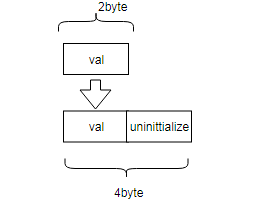

# DrMemory

Dr. Memory 建立在 DynamoRIO 这个动态二进制插桩平台上。动态监测程序的运行，并对内存访问相关的执行代码进行动态修改，记录其行为，并采用先进的算法进行错误检查。

## 基本介绍

官网：
https://drmemory.org/
文档：
https://github.com/DynamoRIO/drmemory
源码：
https://github.com/groleo/mpatrolhttps://dynamorio.org/drmemory_docs/page_options.html

## 支持

可在Linux，Windows，MacOSX，和Android操作系统上使用。能够支持运行在商用的IA-32、AMD64和ARM硬件上。

## 安装

无需安装，直接在源码包中路径调用可执行文件即可：

1. 从https://github.com/DynamoRIO/drmemory/wiki/Downloads下载对应操作系统的Dr. Memory压缩（tar.gz）文件。

2. 保存并解压包到您选择的目录。比如使用命令：
tar -xvzf DrMemory-YourOperatingSystem-VersionXX.tar.gz

3. 从现在起，我们假设DrMemory存在在目录 ~/DrMemory-YourOperatingSystem/。

4.在Dr. Memory中运行你的程序。例如：

```
~/DrMemory-YourOperatingSystem-VersionXX/bin/drmemory -- foo.out arg1 arg2
```

使用你的可执行文件和命令行参数替换“foo.out arg1 arg2”。

5.Dr. Memory会在运行过程中将错误打印在屏幕上，同时在程序终止时打印所发现错误摘要。

其他注意：
1.Dr. Memory可以用在32位或64位程序上（只在Linux上），但针对32位程序，Dr. Memory能追踪和报告更多类型的内存错误。所以建议你最好能建立和运行32位应用程序。在64位的Ubuntu操作系统上，你可能会想安装这些额外的软件包：
sudo yum install g++-multilib

2.你可以在你的编译器中使用-m32，从而编译和生成32位程序。请务必使用-g选项生产调试信息。例如：
g++ -g -m32 main.cpp foo_main.cpp foo_other.cpp -o foo.out

问题：
1.libgcc_s.so.1: cannot open shared object file: No such file or directory
https://confluence.atlassian.com/stashkb/libgcc_s-so-1-cannot-open-shared-object-file-no-such-file-or-directory-314446683.html
安装对应的库
yum install libgcc_s.so.1

## 使用

### 基本使用方法

在Dr. Memory中运行你的程序。

例如：

```shell
~/DrMemory-YourOperatingSystem-VersionXX/bin/drmemory -- foo.out arg1 arg2
```

使用你的可执行文件和命令行参数替换“foo.out arg1 arg2”。

## 原理

> 主要在性能、准确度、系统依赖上进行提高

### key

- 呈现一种透明的插桩技术

- 在堆内存中识别和分隔栈使用的新技术

- 对基于可达性的泄漏检测进行分类，并且提出避免它们的新技术。

- 提出了一个编码调用栈(编码二进制调用)，大大减少内存消耗。


### overview

描述了一系列仪器技术和优化，这些技术和优化提高了最先进的内存检查工具Memcheck的性能，平均为2倍，在单个基准上达到4倍。


### 影子状态

使用**阴影内存**去跟踪数据访问是否正确，每个字节的阴影映射值为下面三种状态之一：

- unaddressable  非法地址
- uninitialized  未初始化的地址
- defined  已初始化的有效地址


其中：

- 非法内存页面是unaddressable  
- 栈顶部以外的内存被认为是unaddressable
- 在分配的malloc块之外的堆上的内存也是unaddressable


### 工具的行为

读或写unaddressable数据将报告错误，但是检测读未初始化数据是更加复杂的。

值的复制通常以单词长度复制。一个一字节或者二字节的变量通常会以四字节的长度进行复制(推到栈或其他地方)。(对于32位系统。64位系统可能是8位)



如果没有显示的将这个变量打包到一个结构体，那么后面对齐的字节都是未初始化的。

**假如对那段未初始化的数据进行读，很多工具会对上面的这种情况产生误报，使得该工具不好使用。**


？为了剔除上面这种情况，不使用与相应的应用程序内存位置永久关联的阴影元数据，而是动态的传播去mirror程序数据流，并且只报告影响程序行为的重要读取错误。例如：

- 条件跳转的比较
- 将数据流传递给系统调用

> 这要求我们不仅对内存，而且还要对寄存器进行阴影处理。

我们的实现通过通用寄存器传播阴影值，但不传播浮点或多媒体寄存器，因为后者很少出现字节对齐(sub-word)问题。

如何维持阴影元数据核检查错误？

- 拦截对分配内存的库程序的调用，例如malloc和HeapAlloc，同时两个动作：
  - 在分配区域附近添加redzones
  - 更新阴影内存值为有效访问状态


传播影子元数据需要对几乎每个应用程序指令采取行动

> 当在传播过程中组合两个阴影值（例如，两个源操作数到算术指令）时，一般规则是未定义的与定义的结果组合在未定义中。 我们对阴影值进行编码，这样我们就可以使用比特或计算这个操作。


### 插桩系统

DynamoRIO作为底层框架。


### 高效的实现方法

####  Shadow Metadata

寄存器的影子元数据存储在可直接寻址的线程本地存储中，消除了访问寄存器的任何需要。

对于内存，我们执行表查找，将应用程序地址转换为相应的阴影地址。

我们的翻译表将地址空间划分为相同的区域，并使用阴影块存储每个区域的阴影值。

使用2bit去编码对于应用程序每byte的阴影状态，一个对齐的四字节应用程序字的阴影状态可以打包成一个阴影字节并且立马操作


#### Fastpath and Slowpath

快速路径是作为一组精心手工制作的机器代码序列或内核实现的，涵盖了最关键的性能操作。快速路径内核要么直接内联，要么使用共享代码与快速子程序开关。

慢速路径主要是处理一些比较复杂的操作，非对齐内存引用、复杂指令、错误报告和分配处理都是在慢路径中完成的。

> 虽然大多数时间的执行都停留在快速路径上，但慢路径必须是有效的，以避免成为性能瓶颈。


Instrumentation Optimizations(8个优化)

- 可寻址性表查询
- 使用故障去检测特殊阴影块的写入
- Whole-basic-block register spilling
-  Binary callstacks
-  Fast replacement routines
- Sharing shadow translations
- Fast stack adjustment handling
- *) Storing displacements in the translation table


### 堆跟踪

很多堆跟踪得策略设计都是由复杂的windows环境决定的。这些多层堆例程，可能从应用程序或库直接调用到每一层，并且在每一层有可能进行子分配，从而使堆跟踪复杂化

**使用包装(wrap)进行插桩。**

Pin和Valgrind都在应用程序堆栈上添加了一个额外的栈帧，这违反了透明度！

透明包装方法：

一旦进入函数，就获取返回地址作为后面post_hook使用。


#### 从堆中区分栈


会出现上面这种情况，在进行堆交换的时候，我们我能会将两个栈的数据相隔开，中间是未定义的数据，作为一个大堆栈上的解除分配，然后我们将标记新堆栈顶部以外的所有内存为不可寻址，但是其实是可以寻址的，最终导致会产生误报。

开发了一种自动调整阈值的方案，它消除了手动指定值的任何需要。 我们在两个方向上调整阈值，但是由于检测一个太小的阈值比一个toolarge阈值要容易得多，所以我们从一个相对较小的值36KB开始。 相比之下，这比Memcheck的默认值小了大约50倍。


### 内存泄漏分类

内存泄露是常见的内存错误，我们可能都曾经遇到过。不过 Dr.Memory 对内存泄露的定义比较独特，在程序退出之前，Dr.Memory 把所有依然被分配的内存分为三类：

1.Still-reachable allocation

很多程序分配了内存之后，在其整个生命周期内都不释放。虽然这是一种泄露，但实际上多数情况下这是无害的，甚至是特意这样设计的。因此 Dr.Memory 并不认为这是一种内存泄露，而称之为”Still-reachable allocation”。

2.Leak

有一些内存无法再被释放，因为指向该内存的指针丢失了。

3.Possible Leak

如前所述指向内存的指针被修改会被认为是一个 Leak，但并非所有的指针修改都是一个 Leak。DrMemory 利用一些经验规则(Heuristic)将以下几种指针修改列为 Possible Leak。

第一种情况：C++程序利用 new[]分配了一个数组，该数组的每个元素都是 拥有自己的析构函数的复杂数据结构

第二种情况，某些 C++编译器在处理多继承时，会出现 mid-chunk 指针。

还有一种可能：std::string 类把一个 char[]数组放置在分配空间中，并返回一个指针直接指向它，造成了一个 mid-allocation 指针。

> 相比其他工具而言，DrMemory的精确度更高一些。


## 优点和缺点

优点：

1. 使用方便。可以直接检查已经编译好的可执行文件。用户不用改写被检查程序的源代码，也无须重新链接第三方库文件，使用起来非常方便。
2. Dr. Memory 建立在 DynamoRIO 这个动态二进制插桩平台上，运行性能高。
3. DrMemory 对内存泄露的监测采用了比较独特的算法，大量减少了”false positive”，即虚假错误。

缺点：https://dynamorio.org/drmemory_docs/page_release_notes.html#sec_limits
1.ARM平台尚不支持未初始化的读取检查。
2.定义性是在字节级别而不是位级别进行跟踪的，使用位域时可能导致误报。

