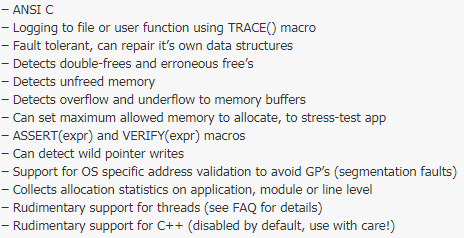

# Memwatch

由 Johan Lindh 编写，是一个开放源代码 C 语言内存错误检测工具。包含dmalloc的功能，不推荐线程、C++使用，内容填充，未初始化0XFE，释放后0XFD，根据校验判断。

## 基本介绍

官网、源码： https://www.linkdata.se/sourcecode/memwatch/

参考使用地址： https://blog.51cto.com/brantc/116677

## 支持

是一个库，使用C语言实现，能够支持C语言的平台都能够支持。

## 安装

memwatch不需要安装，因为它只是一组C程序代码。需要做的是：
1、在代码中加入 memwatch.c 和 memwatch.h，一起编译、链接
2、编译时定义宏 `DMEMWATCH`、`DMW_STDIO`，即在编译程序时加上选项`-DMEMWATCH -DMW_STDIO`

## 使用

### 基本功能



– ANSI C
–使用TRACE（）宏登录文件或用户功能
–容错，可以修复自己的数据结构
–检测双释放和错误释放
–检测未释放内存
–检测到内存缓冲区的上溢和下溢
–可以设置允许分配的最大内存，以对应用程序进行压力测试
– ASSERT（expr）和VERIFY（expr）宏
–可以检测野指针写入
–支持特定于操作系统的地址验证以避免GP （分段错误）
–收集有关应用程序，模块或行级别的分配统计信息
–对线程的基本支持（有关详细信息，请参见FAQ）
–对C ++的基本支持（默认情况下禁用，请谨慎使用！）

memwatch可以跟踪程序中的内存泄漏和错误，能检测双重释放(double-free)、错误释放(erroneous free)、没有释放的内存(unfreed memory)、溢出(Overflow)、下溢(Underflow)


### 基本使用方法

1. 将memwatch.c和memwatch.h放在需要编译的文件所在的文件夹：

   

2. 然后执行编译指令:

   ```shell
   gcc -DMEMWATCH -DMW_STDIO test.c memwatch.c -o test
   ```

   

   执行完成之后会在当前目录生成一个日志文件memwatch.log，里面记录了一些检测的信息。

### 日志文件

日志文件memwatch.log中包含的信息主要有以下几点：
*  测试日期
*  状态搜集器的信息
*  使用MemWatch的输出函数或宏（如TRACE等）的信息。
*  MemWatch捕获的错误信息
*  内存使用的全局信息统计，包括四点：
1）分配了多少次内存
2）最大内存使用量
3）分配的内存总量
4）为释放的内存总数

MemWatch捕获的错误记录在日志文件中的输出格式如下：

```
message: <sequence-number> filename(linenumber), information
```

## 原理

参考：https://blog.51cto.com/brantc/116677

### 内存原理

 **MemWatch将所有分配的内存用0xFE填充，所以，如果你看到错误的数据是用0xFE填充的，那就是你没有初始化数据。**

> 例外是calloc()，它会直接把分配的内存用0填充。

 MemWatch将所有已释放的内存用0xFD填充(zapped with 0xFD).如果你发现你使用的数据是用0xFD填充的，那你就使用的是已释放的内存。在这种情况，注意MemWatch会立即把一个"释放了的块信息"填在释放了的数据前。这个块包括关于内存在哪儿释放的信息，以可读的文本形式存放，格式为"FBI<counter>filename(line)"。如:"FBI<267>test.c(12)".使用FBI会降低free()的速度，所以默认是关闭的。使用mwFreeBufferInfo(1)开启。

 为了帮助跟踪野指针的写情况，MemWatch能提供no-mans-land（NML）内存填充。no-mans-land将使用0xFC填充.当no-mans-land开启时，MemWatch转变释放的内存为NML填充状态。

 

### 初始化和结束处理

一般来说，在程序中使用MemWatch的功能，需要手动添加mwInit()进行初始化，并用对应的mwTerm ()进行结束处理。

当然，如果没有手动调用mwInit()，MemWatch能自动初始化.如果是这种情形，memwatch会使用atext()注册mwTerm()用于atexit-queue. 对于使用自动初始化技术有一个告诫;如果你手动调用atexit()以进行清理工作，memwatch可能在你的程序结束前就终止。为了安全起见，请显式使用mwInit()和mwTerm().

涉及的函数主要有：

mwInit()   mwTerm()   mwAbort()

 

### IO操作

1. 对于一般的操作，MemWatch创建memwatch.log文件。有时，该文件不能被创建;MemWatch会试图创建memwatNN.log文件，NN在01~99之间。

2. 如果你不能使用日志，或者不想使用，也没有问题。只要使用类型为"void func(int c)"的参数调用mwSetOutFunc()，然后所有的输出都会按字节定向到该函数.

3. 当ASSERT或者VERIFY失败时，MemWatch也有Abort/Retry/Ignore处理机制。默认的处理机制没有I/O操作，但是会自动中断程序。你可以使用任何其他Abort/Retry/Ignore的处理机制,只要以参数"void func(int c)"调用mwSetAriFunc()。后面在1.2使用一节会详细讲解。

涉及的函数主要有：

mwTrace()      mwPuts()     mwSetOutFunc()  mwSetAriFunc()

mwSetAriAction()   mwAriHandler()  mwBreakOut()


## 优点和缺点

### 优点

1. 使用简单，只需要包含头文件和实现文件一起编译即可

### 缺点

1. Memwatch会使系统速度变慢，但是大的内存分配不受影响。
2. 释放内存的速度会检测很多东西，速度变慢为5-7倍，无论内存多大。
3. 不是线程安全的。
4. 无法用于内核模块，因为MemWatch自身就使用了应用层的接口，而不是内核接口。
5. 该工具无法检测到写入已释放的地址的尝试或从分配的内存外部读取数据的尝试。
6. 将它与用C ++编写的程序一起使用，则无法保证该工具的行为。


---

参考链接：

1. https://www.cnblogs.com/klcf0220/p/5962834.html
2. https://blog.csdn.net/xkdcc/article/details/1270155
3. https://blog.csdn.net/q297299899/article/details/24253441