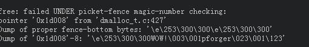

# Dmalloc

**Debug Malloc Library**是一种用于检查C/C++内存泄露(leak)的工具，即检查是否存在直到程序运行结束还没有释放的内存，并且能够精确指出在哪个源文件的第几行。

## 基本介绍

官网： https://dmalloc.com/
源码： https://github.com/j256/dmalloc
文档： https://dmalloc.com/docs/

## 支持

支持的平台：AIX, BSD/OS, DG/UX, Free/Net/OpenBSD, GNU/Hurd, HPUX, Irix, Linux, MS-DOG, NeXT, OSF, SCO, Solaris, SunOS, Ultrix, Unixware, Windoze, and even Unicos on a Cray T3E

## 安装

参考地址：https://blog.csdn.net/cjsycyl/article/details/6340571

依次执行以下的命令：
(1) tar -zvxf dmalloc-5.5.2.tgz
(2) cd dmalloc-5.5.2
(3) ./configure --enable-threads
(4) make
(5) make install
______a) install libdmalloc.z到/usr/local/lib/目录下；
______b) install dmalloc.h到/usr/local/include/目录下；（Permission denied, so should sudo make install）
______c) install dmalloc到/usr/local/bin/目录下。

**设置环境变量**

对于 Bash, ksh, and zsh，在 `.bashrc', `.profile', or `.zshrc'文件中加入一行 ( -b 参数表示针对Bash的输出):
function dmalloc { eval `/usr/local/bin/dmalloc -b $*`; } 
然后执行：
source ~/.bashrc 或 source ~/.profile
接下来执行：
dmalloc -l logfile -i 100 low

## 使用

### 基本特性

1.文件和行号信息
2.返回地址信息
3.内存边界检查
4.堆内存一致验证
5.日志统计
6.检查释放的内存

### 基本使用方法

针对需要使用dmalloc的源代码作如下修改：
(1) 在源代码中，添加下面的C代码：

```c
#ifdef DMALLOC
#include "dmalloc.h"
#endif
```

(2) 添加参数或者在Makefile中，添加 `-DDMALLOC -DDMALLOC_FUNC_CHECK`
如： 

```shell
gcc -DDMALLOC -DDMALLOC_FUNC_CHECK dm_hello.c -o dm_hello -ldmalloc 
```

或者:

```sh
cc -DDMALLOC -DDMALLOC_FUNC_CHECK -ggdb -Wall dm_hello.c -o dm_hello -ldmalloc
```

(3) 添加-ldmalloc选项 运行之后，可以在/home/user/mydmalloc.log中查看检测信息。如果不使用绝对路径，则logfile会生成在app所在的目录。

## 原理

### 获取调用地址信息

该库试图使用一些程序集hack来获取返回地址或调用dmalloc函数的行地址。如果启用了log-unknown令牌并运行程序，则可能会看到以下未释放的内存消息。


不能提供回复地址信息的系统显示为unknown，如上例中的第二行所示。


### 追踪非释放内存

在下方，您将看到日志文件中一些未释放的内存消息的样本。在第一行中，0x45008是未释放的指针，12字节是未释放块的大小，ra = 0x1f8f4或return-address显示分配源于何处


为了解决这个问题，库可以在它被释放后将特殊值写入内存块中。 这有两个目的：它将确保程序将获得垃圾数据，如果它试图再次访问该区域，它将允许库稍后验证该区域的覆盖迹象

### 检测写溢出

他的图书馆首先向您显示正确的栅栏信息应该是什么样，然后再显示指针的错误信息是什么。如果无法打印字符，它将以\ ddd形式显示值，其中ddd是三个八进制数字。



上面的示例显示，指针‘0x1d008’已覆盖其较低的栅栏柱区域。 这意味着代码写在地址的下方或地址的下方。 在样本中，完成它的字符串是“WOW！“


## 兼容性问题

- *不*支持Realloc（）向后兼容，因为它可以从最后释放的块中进行重新分配。作者有兴趣了解谁在使用此功能（咳嗽，咳嗽）以及出于什么原因。
- 支持NULL指针的Realloc（），在这种情况下，库将仅调用malloc（）。可以通过`conf.h`文件中的手动编译选项禁用此功能。
- 某些系统出于某些原因允许free（0）不会成为错误。由于0不是malloc调用返回的有效地址，因此应该允许这样做是有争议的。请参见`conf.h`中的一些手动编译选项以解决此问题。
- 除了可能比系统的内存分配功能慢之外，该库还应该与标准内存例程完全兼容。如果*不是*这种情况，请引起我注意。


## 优点和缺点

### 优点

1. 支持C++与C
2. 支持线程
3. 支持跨平台，提供的可配置性选项。它还具有高度的可移植性

### 缺点

1. 只能检测堆上的内存，对栈内存和静态内存无效。(不能检测栈内存)
2. 只能检测用malloc申请的内存，而对使用sbrk()或者mmap()分配的内存无能为力。
3. 库不会（默认情况下）报告没有关联文件和行信息的内存
4. 执行过程不能热添加
5. 这个库从来没有（也许永远不会）优化空间或速度。 它的一些特性使得它无法使用其他更有效的堆库的一些组织方法
6. 不会检测读溢出，只检测写溢出。