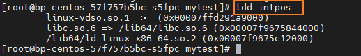

# 库打桩机制

LInux链接器有强大的库打桩机制，它允许你对共享库的代码进行截取，从而执行自己的代码。而为了调试，你通常可以在自己的代码中加入一些调试信息，例如，调用次数，打印信息，调用时间等等。


## 基本原理

### 基本思想

给定需要打桩的目标函数，常见一个wrapper函数，其原型和目标函数一致。利用特殊的打桩机制，可以实现让系统调用你的wrapper函数而不是目标函数。wrapper函数中通常会执行自己的逻辑，然后调用目标函数，再将目标函数的返回值传递给调用者。

> 打桩可以发生在编译时、链接时或者程序被加载执行的运行时。不同的阶段都有对应的打桩机制，也有其局限性。


## 打桩时期


### 编译时打桩

> 使用 C 预处理器在编译时打桩。


这样编译和链接程序

```bash
gcc -DCOMPILE_TIME -c mymalloc.c
gcc -I. -o intpos main.c mymalloc.o
```

执行：

```bash
./intpos
```


### 链接时打桩

> 链接(linking)是将各种代码和数据片段收集并组合成为一个单一文件的过程，这个文件可被加载（复制）到内存并执行。


### 运行时打桩


## GCC相关参数

| 参数    | 功能                                                         |
| ------- | ------------------------------------------------------------ |
| -c      | 只激活预处理,编译,和汇编,也就是他只把程序做成obj文件,将生成 .o 的 obj 文件<br />例子：```gcc -c hello.c``` |
| -S      | 只激活预处理和编译，就是指把文件编译成为汇编代码,将生成 .s 的汇编代码。<br />例子：```gcc -S hello.c ``` |
| -E      | 只激活预处理,这个不生成文件, 你需要把它重定向到一个输出文件里面。<br />例子：```gcc -E hello.c > pianoapan.txt  gcc -E hello.c | more ``` |
| -o      | 指定目标名称                                                 |
| -g      | 只是编译器，在编译的时候，产生调试信息。                     |
| -static | 此选项将禁止使用动态库，所以，编译出来的东西，一般都很大，也不需要什么动态连接库，就可以运行。 |
| -share  | 此选项将尽量使用动态库，所以生成文件比较小，但是需要系统由动态库。 |


我们通过ldd命令查看程序链接的系统库：




---

参考链接：

1. https://zhuanlan.zhihu.com/p/76036630
2. https://www.cnblogs.com/tocy/p/Linux-library-Interposition.html
3. [GCC 参数详解](https://www.runoob.com/w3cnote/gcc-parameter-detail.html)

