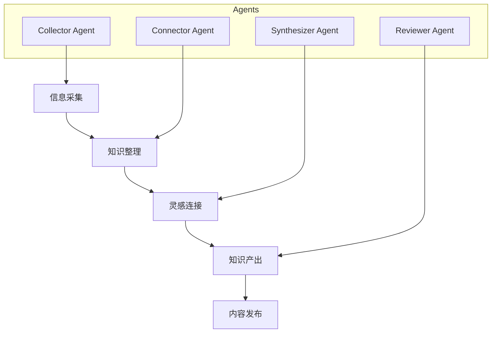

## 写在最近我在思考一个问题：知识管理的未来是什么？

作为一个重度知识管理工具使用者，我尝试过 Notion、Obsidian、Logseq 等各种工具。它们各有优缺点，但都有一个共同问题：知识是静态的。

直到我开始使用多 Agent 协作的方式管理知识，才发现：知识不应该只是存储，而应该流动、生长、产出。

## 什么是多 Agent 知识管理？

多 Agent 知识管理是指使用多个 AI Agent 协同工作，帮你完成知识的收集、整理、加工和产出。

## 核心架构

### 三层架构

1. **采集层**：使用 opencli 等工具从 X/Twitter、RSS、网页等来源抓取信息
2. **存储层**：本地 Markdown 文件 + Git 版本控制 + Notion 协作界面
3. **产出层**：Hugo 静态博客 + 多平台分发

### Agent 分工

| Agent | 职责 | 触发方式 |
|-------|------|---------|
| Collector | 定时抓取高价值内容 | 定时任务 |
| Connector | 建立笔记间关联 | 新增笔记时 |
| Synthesizer | 整合灵感为永久笔记 | 灵感积累到阈值 |
| Reviewer | 质量审查与归档 | 每周定时 |

## 实践：从 Notion 到本地 Markdown

### Notion 的局限性
- API 速率限制，大量操作困难
- 数据导出后格式丢失
- 深度搜索性能不足
- 需要联网才能使用

### 本地 Markdown 的优势
- 完全控制数据
- 离线可用
- Git 版本控制
- 与 AI Agent 无缝集成

## 技术栈

- **Hugo**：静态站点生成器
- **zzo 主题**：简洁美观的博客主题
- **GitHub Actions**：自动部署
- **R2 + Cloudflare**：图片托管
- **Notion**：协作与共享界面

## 工作流

1. 收到链接/想法 → 保存到 Notion「文献笔记」
2. Agent 自动关联领域和标签
3. 定期回顾灵感笔记
4. 整合为永久笔记
5. 发布到 Hugo 博客
6. 多平台分发

## 总结

多 Agent 知识管理不是替代人类思考，而是放大人类思考的效率。

核心理念：
- 人是核心：Agent 是工具，你是决策者
- 本地优先：数据在你手中
- 流动优于静态：知识在流动中产生价值
- 产出优于存储：写下来不如用起来

---

*这是一个测试文章，用于验证 Hugo 博客的发布流程。*
