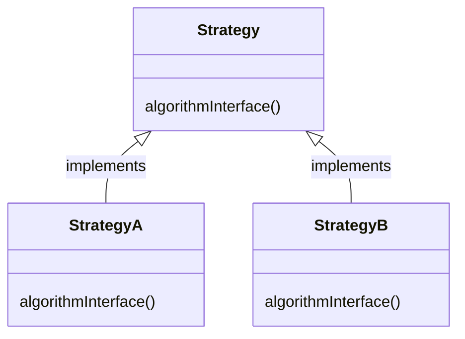
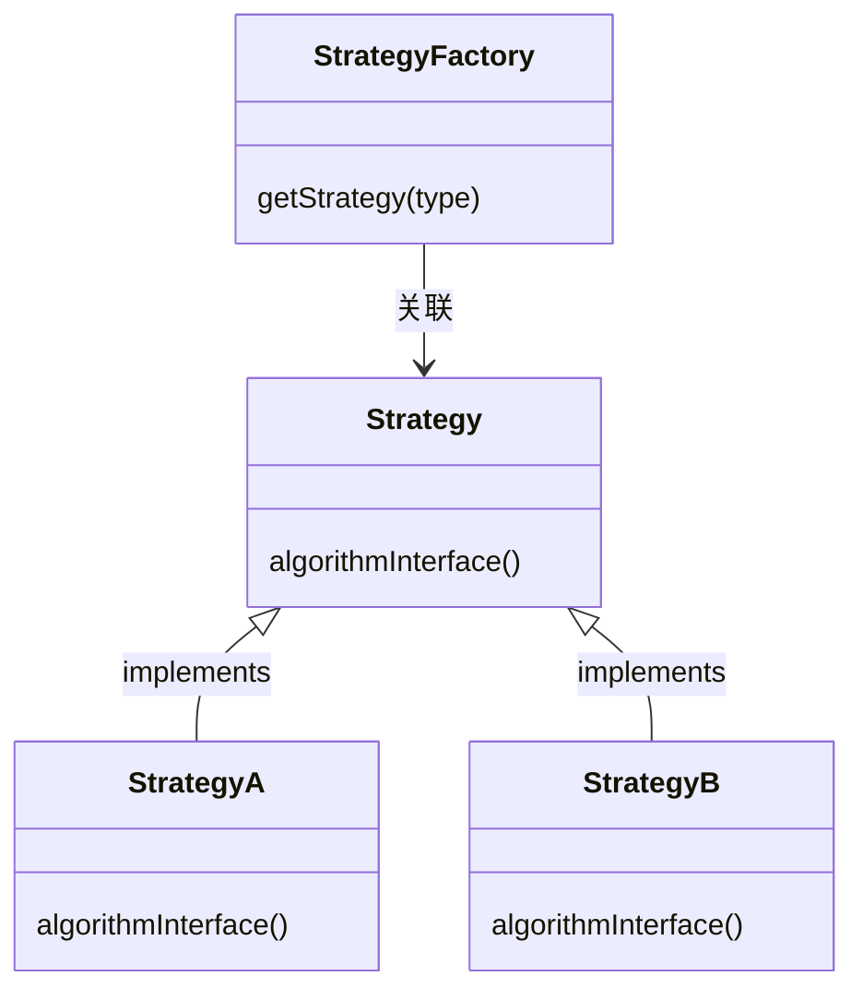
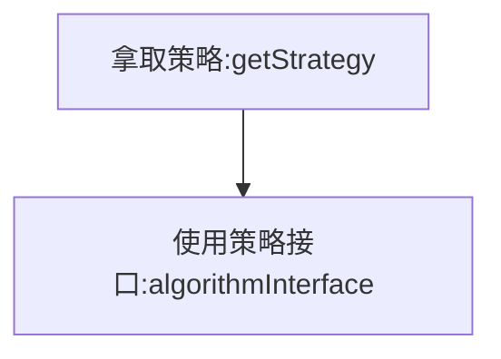
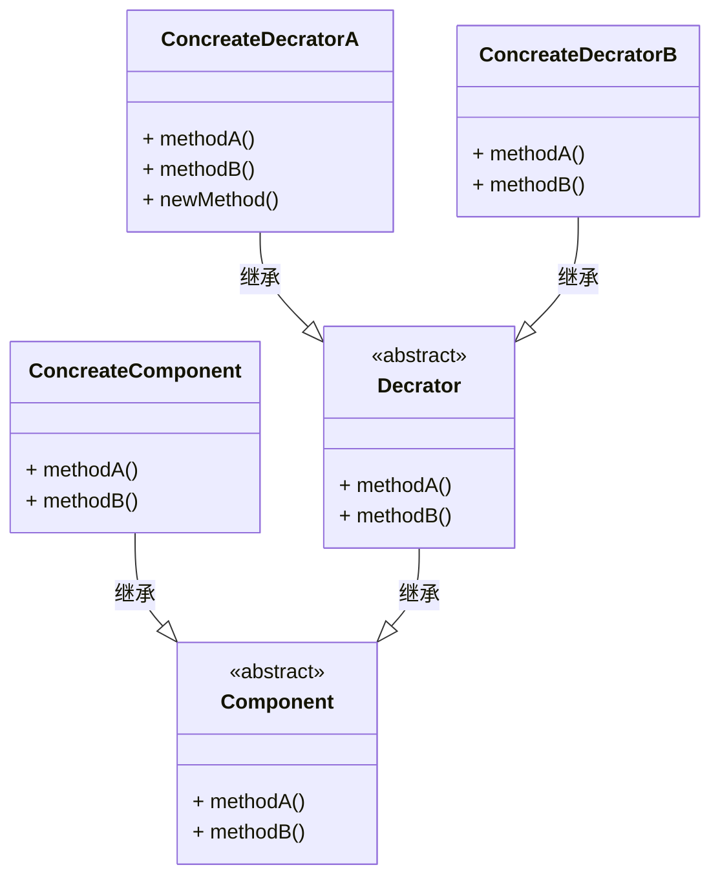
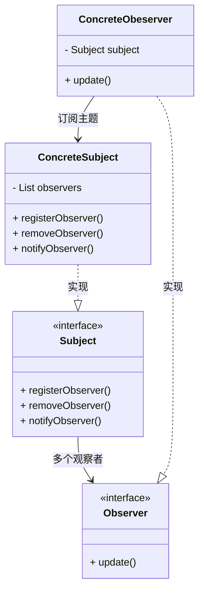




## 原则


### 设计原则

1. 单一职责原则

   Single Responsibility Principle，一个类应该只负责一个职责。

2. 开闭原则

   Open-Closed Principle, OCP，一个软件实体应当对扩展开放，对修改关闭。即软件实体应尽量在不修改原有代码的情况下进行扩展。

3. 里氏替换原则

   Liskov Substitution Principle, LSP，所有引用基类（父类）的地方必须能透明地使用其子类的对象。（其实就是使用多态）

4. 依赖注入原则

   Dependence Inversion Principle, DIP，抽象不应该依赖于细节，细节应当依赖于抽象。换言之，要针对接口编程，而不是针对实现编程。

   关键点为：

   1. 高层模块不应该依赖低层模块，两者都应该依赖其抽象
   2. 抽象不应该依赖细节
   3. 细节应该依赖抽象

5. 接口分离原则

   Interface Segregation Principle, ISP，使用多个专门的接口，而不使用单一的总接口，即客户端不应该依赖那些它不需要的接口。

6. 迪米特原则

   Law of Demeter 又名Least Knowledge Principle, LoD，一个软件实体应当尽可能少地与其他实体发生相互作用。

   > 体现了封装的思想。


## 设计模式分类一览

### 单例模式




定义：

**单例设计模式**（Singleton Design Pattern）理解起来非常简单。一个类只允许创建一个对象（或者实例），那这个类就是一个单例类，这种设计模式就叫作单例设计模式，简称单例模式。


架构：比较简单，不画了。


使用场景：

- 线程池
- 缓存
- 对话框
- 注册表对象
- 日志对象


### 状态模式




定义：

状态模式允许对象在内部状态发生改变时改变它的行为。（对象看起来好像改变了它的类）


架构：


实现方法：

1. 分支逻辑法
2. 查表法
3. 状态模式


使用场景：

- 状态模式一般用来实现状态机，而状态机常用在**游戏、工作流引擎等系统开发**中。或者在一些单据的流转上也可以使用状态模式。



状态模式可以随着时间改变状态，从而执行不同的行为；但是策略模式是事先准备好多种策略，在开始的时候选择了一种策略就是一直使用这种策略进行处理。（可以说，状态模式运行时使用了所有的状态，而策略模式在运行时只使用了一种策略）



### 策略模式




定义：

策略模式定义了算法族，分别封装起来，让他们之间可以互相替换。**此模式让算法的变化独立于使用算法的客户**。


架构：

策略定义：



策略创建：



- 无状态策略：无状态的策略因为不会变，可以进行缓存，一开始就创建好所有的策略即可。（直接从map中拿取）
- 有状态策略：有状态的策略因为会改变，所以每次创建都需要是一个最新的策略对象。（在工厂类中存在if-else判断）


策略使用：

​	



1. 从工厂类中拿取策略。
2. 调用策略对应的接口函数。


使用场景：

1. 避免冗长的if-else或switch分支判断
2. 提供框架的扩展点


### 模版方法模式




定义：

模板方法模式在一个方法中定义一个算法的架构，而将一些步骤延迟到子类中。模板方法使得子类可以在不改变算法结构的情况下，重新定义算法中的某些步骤。


架构：


使用场景：

1. 复用

   因为模板方法是基于继承实现，可以将固定的算法步骤封装在抽象类，抽象类可以实现一些固定的步骤，子类直接进行复用就可以了。

2. 框架拓展性

   - HttpServlet的service()方法就是一个模板方法，它实现了整个http请求的执行流程，而doGet()和doPost()是模板中可以由子类自定义的部分。相当于框架为用户提供了拓展点，使得不需要修改框架源码就能将拓展点添加到框架中。
   - Junit框架也提供了一些功能拓展点setUp()和setDown()，可以在开始和结束的时候做一些事情，而runBase()函数是一个模板方法，定义了执行测试用例的整体流程。




- 策略模式和模板方法模式都封装算法，但是一个组合，一个继承。
- 工厂方法是模板方法的一个特殊版本。




### 适配器模式

适配器使得新的调用可以适配老的接口而不需要修改旧的代码。达到了对拓展开发，对修改关闭的设计原则。


定义：

适配器将一个类的接口，转换成客户端期望的另一个接口。适配器让原本不兼容的类达到兼容。（可以让客户从实现的接口解耦）

> USB转接头就是一个适配器！


架构:


在支持多重继承的语言中，可以使用类适配器是这样的：


使用场景：


一般来说，适配器模式可以看作是一宗“补偿模式”，用来补救设计上的缺陷，也是一种无奈之举。一般也不会优先推荐使用这种模式。


</br>

1. 封装有缺陷的接口

   例如外部引入的接口都是静态方法，会影响代码的可测试性。此时使用适配器进行适配接口，将静态方法都“封装“起来，这样就可以进行测试了。

   ”缺陷“可以理解为在某些方面不足。通过封装之后达到解决问题的效果就是适配器作用。

2. 替换依赖的外部系统

   当需要将外部依赖的一个系统替换成另一个系统的时候，也就是一些系统迁移或者接口切换的场景，使用适配器模式可以减少对代码的改动。

   

3. 兼容老版本的接口

   在进行一些版本升级的时候，对于一些废弃的接口，我们不会直接删除，而是暂时保留，并且标注为deprecate，并且将内部实现逻辑委托为新的实现逻辑。

   例如JDK中包含一个遍历集合容器的类Enumeration，JDK2.0对这个类进行了重构，将它改名为Iterator类，并且对它的代码实现做了优化。但是如果将Enumeration直接从JDK2.0删除，那么那些从JDK1.0升级到JDK2.0的项目，就会编译报错。但是修改散落在各处的Enumeration调用又多又杂，导致升级困难。为了避免这种情况，可以暂时保留Enumeration类，并且将其内部实现替换为Iterator的实现。

   ```java
   public class Collections {
       public static Emueration emumeration(final Collection c) {
         return new Enumeration() {
            Iterator i = c.iterator();
           
            public boolean hasMoreElments() {
               return i.hashNext();
            }
           
           public Object nextElement() {
             	return i.next():
           }
          }
       }
   }
   ```



装饰器包装一个实现同一个接口的类对象，添加一些责任，并且接口不变；适配器则包装实现不同接口的被适配的对象，进行接口的转换和适配，以达到兼容的效果。



### 工厂方法模式



当我们使用new创建一个对象的时候，需要指定一个具体类，这就是针对实现进行编程。当我们将创建对象的过程封装成一个方法或者接口的时候，就可以避免针对实现编程，变成针对接口编程。


定义：

工厂方法模式定义了一个创建对象的接口，但由子类决定要实例化的类是哪一个。工厂方法将实例化推迟到子类。

> 核心在将创建对象的过程解耦出来。


架构：


工厂模式体现了一个原则：依赖倒置原则。（Spring叫依赖反转）

关键点:

- 工厂只有一个功能——创建指定的类。（单一职责）
- 将原来的if-else判断，转换成对象进行处理。
- 抽象成一个方法 -》 抽象成一个类 -〉 抽象成一个接口


> 抽象工厂模式
>
> 定义：抽象工厂模式提供一个接口，用于创建相关或者依赖对象的家族，而不需要明确指定具体类
>
> 架构：
>
> ```mermaid
> classDiagram
> class AbstractFactory {
> 	<<interface>>
> 	+ createProductA()
> 	+ createProductB()
> }
> 
> 
> class ConcreteFactoory1 {
> 	+ createProductA()
> 	+ createProductB()
> }
> 
> class ConcreteFactoory2 {
> 	+ createProductA()
> 	+ createProductB()
> }
> 
> 
> class AbstractProductA {
> 	<<interface>>
> }
> 
> class ProducttA1
> class ProducttA2
> 
> 
> ProducttA1 ..|> AbstractProductA : 实现
> ProducttA2 ..|> AbstractProductA : 实现
> 
> class AbstractProductB {
> 	<<interface>>
> }
> 
> class ProducttB1
> class ProducttB2
> 
> ProducttB1 ..|> AbstractProductB : 实现
> ProducttB2 ..|> AbstractProductB : 实现
> 
> 
> AbstractFactory <|.. ConcreteFactoory1 : 实现
> AbstractFactory <|.. ConcreteFactoory2 : 实现
> 
> ConcreteFactoory1 -->ProducttA1 : 创建
> ConcreteFactoory1 -->ProducttB1 : 创建
> 
> ConcreteFactoory2 -->ProducttA2 : 创建
> ConcreteFactoory2 -->ProducttB2 : 创建
> 
> ```
>
> 抽象工厂模式类似于一个二维的分类，将更加复杂的系统进行整理并且划分。以达到解耦的效果。
>
> 


使用场景：


### 建造者模式




待补充......


### 命令模式




定义：

命令模式将“请求”封装成对象，以便使用不同的请求、队列或者日志来参数化其他对象。命令模式也可以支持撤销的操作。

> 命令模式主要是将“命令的请求者”从“命令的执行者”对象中解耦。


架构：


命令模式对象可以包含接受者的引用，也可以不包含，因为在远程调用的情况下，不能获取引用。


使用场景：

- 异步、延迟、排队执行命令、撤销重做命令、存储命令、命令记录日志
- Hystix**熔断**框架就用到了命令模式
- redis使用命令模式处理指令


### 组合模式




定义：

组合模式允许你将对象组合成树形结构来表示“整体/部分”的层次结构。组合能够让客户以一致的方式处理个别对象以及对象组合。


架构：


使用场景：

使用组合模式的前提在于，你的业务场景必须能够表示成树形结构。所以，组合模式的应用场景也比较局限，它并不是一种很常用的设计模式。

> 需要理解“整体和部分”的关系。


### 装饰器模式




定义：

装饰器模式动态的将责任附加到对象上，若要拓展功能，装饰者提供了比继承更有弹性的替代方案。


架构：




装饰的技巧可以在不修改任何底层代码的情况下增强功能。


使用场景：

1. Java IO类库（InputStream、OutputStream）

   

2. 在不影响其他对象的情况下，以动态、透明的方式给单个对象添加职责。



使用装饰器模式，常常造成设计中有大量的类



### 迭代器模式




定义：

迭代器模式提供了一种方法顺序访问一个聚合对象中的各个元素，而不暴露其内部的表示。

> 迭代器模式封装了遍历。并且迭代器模式还将在元素之间进行游走的责任交给迭代器，使得职责更加单一。


架构：


使用场景：

- Java Iterator
- 解耦容器代码和遍历代码，使得职责更加单一


### 观察者模式




定义：

观察者模式定义了对象之间的**一对多**依赖，这样一来，当一个对象改变状态时，它的所有依赖者都会收到通知并且自动更新。

> 一个比喻：报纸订阅（出版者和订阅者）


架构：



观察者依赖主题。观察者模式提供了一种对象设计，让主题和观察者之间松耦合。他们依然可以交互，但是不必清楚彼此的细节。


使用场景：

1. 消息队列
2. 回调就是一种观察者模式
3. Google EventBus
4. 邮件订阅
5. RSS
6. 反应式RxJava
7. JDK(CompletableFuture)


### 代理模式




定义：

代理模式为另一个对象提供一个替身或者占位符以控制这个对象的访问。


架构：


使用场景：

- 远程代理：远程代理可以作为另一个JVM上对象的本地代表。常见的是RPC框架。
- 虚拟代理：虚拟代理作为创建开销大的对象的代表。当对象没有得到的情况下执行一些操作。常见的是图片的加载。
- 缓存代理：缓存代理会维护之前的对象，在可能的情况下会返回缓存对象。
- 保护代理：可以根据客户的角色来决定是否允许客户访问特定的方法。（Java动态代理）

其他代理：

- 防火墙代理：控制网络资源的访问，保护访问坏网络。
- 智能引用代理：例如计算一个对象被引用的次数。
- 同步代理：在多线程的情况下为主题提供安全的访问。
- 写入时复制代理：用于控制对象的复制，方法是延迟对象的复制，发那个客户真的需要（也就是需要写入时）才进行复制。是虚拟代理的变体。（Java5的CopyOnWriteArrayList）




- 装饰器模式是为对象增加行为，而代理模式是控制对象的访问。
- 适配器会改变对象适配的接口，而代理则实现相同的接口




### 外观模式




定义：

外观模式定义了一个统一的接口，用来访问子系统中的一群接口。外观定义了一个高层接口，**让子系统更容易使用。**

> 外观模式可以解决接口的复用性和易用性的问题，并且，外观模式可以让层级更加清晰，满足最少知识原则，让暴露的接口或者函数更加少。


架构：


使用场景：

1. 解决易用性

   当接口越来越多，越来越复杂的时候，提供一层更加简单易用，更加高层的接口。例子：Linux系统调用函数封装了Linux内核调用、Linux的Shell命令封装了复杂的系统调用。

   > 单独起起一个API网关层服务做转发和聚合也很类似门面设计模式。

2. 解决性能问题

   将多个接口调用封装成一个简单的门面接口，在一些需要多次请求的网络通信中可以减少通信的次数，降低网络通信的成本，提高APP响应的速度。	

3. 解决分布式事务问题

   门面接口可以将一个事务的多个接口封装在一个接口中，方面进行事务的回滚或者重试。


- 适配器是做接口转换，解决的是原接口和目标接口不匹配的问题。门面模式做接口整合，解决的是多接口调用带来的问题。
- 适配器模式注重的是兼容性，而门面模式注重的是易用性。




### 复合模式

复合模式属于是模式的模式了。复合模式在一个解决方案中结合两个或者多个模式，以解决一般或者重复发生的问题。

MVC架构（模型、视图、控制器）就使用了多种设计模式的复合。其中包括：观察者模式、策略模式、组合模式。

- 观察者模式：模型通知视图和控制器关于自己的改变。
- 策略模式：视图和控制器实现了策略模式，视图可以有多个控制器，相当于有多个策略行为可以互相替换。
- 组合模式：视图内通过组合模式管理窗口显示。


---

***Reference***:

