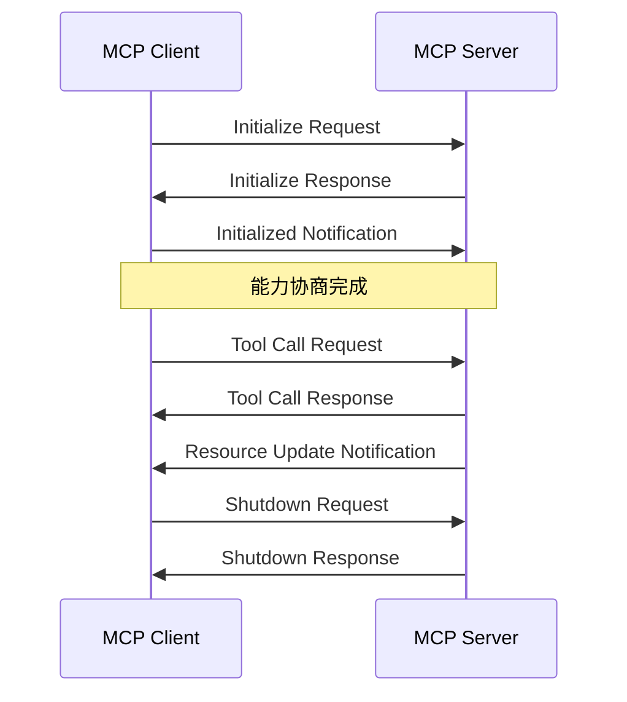

## 什么是 MCP？

MCP（Model Context Protocol，模型上下文协议）是 Anthropic 开源的一个标准协议，用于连接 AI 应用与外部系统。它就像**AI 应用的 USB-C 接口**——提供标准化的方式让 AI 连接到数据源、工具和外部系统。

**核心价值**：
- **标准化**：一次开发，到处运行
- **生态丰富**：支持 Claude、ChatGPT、VS Code、Cursor 等主流平台
- **安全可控**：明确的权限边界和用户授权机制
- **双向通信**：不仅 AI 调用外部工具，外部系统也能请求 AI 能力

---

## MCP 架构原理

### 核心参与者

```
┌─────────────────────────────────────────────────────────────┐
│                    MCP Host (AI Application)                │
│  ┌──────────────┐  ┌──────────────┐  ┌──────────────┐      │
│  │ MCP Client 1 │  │ MCP Client 2 │  │ MCP Client 3 │      │
│  └──────┬───────┘  └──────┬───────┘  └──────┬───────┘      │
└─────────┼─────────────────┼─────────────────┼───────────────┘
          │                 │                 │
          ▼                 ▼                 ▼
┌─────────────────┐ ┌──────────────┐ ┌──────────────────┐
│  MCP Server A   │ │ MCP Server B │ │   MCP Server C   │
│  (本地文件系统)  │ │  (数据库)    │ │   (远程 API)     │
└─────────────────┘ └──────────────┘ └──────────────────┘
```

**三个核心角色**：

1. **MCP Host**：AI 应用主体，如 Claude Code、Claude Desktop、VS Code
2. **MCP Client**：Host 创建的客户端，每个 Server 对应一个 Client
3. **MCP Server**：提供上下文能力的程序，可本地或远程运行

### 分层架构

MCP 采用分层设计，分为**数据层**和**传输层**：

#### 数据层（Data Layer）

基于 **JSON-RPC 2.0** 的协议，定义消息结构和语义：

**生命周期管理**：
- 连接初始化
- 能力协商（Capability Negotiation）
- 连接终止

**核心原语（Primitives）**：

| 原语 | 说明 | 示例 |
|------|------|------|
| **Tools** | AI 可调用的函数 | 搜索、计算、API 调用 |
| **Resources** | 可读取的上下文数据 | 文件内容、数据库记录 |
| **Prompts** | 预定义的交互模板 | 代码审查、文档生成 |
| **Sampling** | Server 请求 LLM 生成内容 | 复杂推理任务 |

#### 传输层（Transport Layer）

定义通信机制和认证方式：

**Stdio Transport**（本地）：
- 使用标准输入/输出流
- 同一机器上的进程间通信
- 性能最优，无网络开销
- 适用于本地文件系统、数据库等

**Streamable HTTP Transport**（远程）：
- HTTP POST + Server-Sent Events
- 支持远程服务器通信
- 支持 OAuth、API Key、Bearer Token 等认证
- 适用于 SaaS 服务、云平台等

---

## MCP 协议详解

### 连接生命周期



### 能力协商（Capability Negotiation）

连接初始化时，双方交换支持的能力：

```json
// Client → Server: Initialize Request
{
  "jsonrpc": "2.0",
  "id": 1,
  "method": "initialize",
  "params": {
    "protocolVersion": "2024-11-05",
    "capabilities": {
      "sampling": {},
      "roots": { "listChanged": true }
    },
    "clientInfo": {
      "name": "claude-code",
      "version": "1.0.0"
    }
  }
}

// Server → Client: Initialize Response
{
  "jsonrpc": "2.0",
  "id": 1,
  "result": {
    "protocolVersion": "2024-11-05",
    "capabilities": {
      "tools": { "listChanged": true },
      "resources": { "listChanged": true },
      "prompts": { "listChanged": true }
    },
    "serverInfo": {
      "name": "weather-server",
      "version": "1.0.0"
    }
  }
}
```

### Tools 详解

Tools 是 MCP 最核心的原语，允许 AI 调用外部函数。

**Tool 定义**：

```json
{
  "name": "get_weather",
  "description": "获取指定城市的天气信息",
  "inputSchema": {
    "type": "object",
    "properties": {
      "city": {
        "type": "string",
        "description": "城市名称"
      },
      "units": {
        "type": "string",
        "enum": ["celsius", "fahrenheit"],
        "description": "温度单位"
      }
    },
    "required": ["city"]
  }
}
```

**Tool 调用流程**：

```json
// Client → Server: Tool Call
{
  "jsonrpc": "2.0",
  "id": 2,
  "method": "tools/call",
  "params": {
    "name": "get_weather",
    "arguments": {
      "city": "北京",
      "units": "celsius"
    }
  }
}

// Server → Client: Tool Result
{
  "jsonrpc": "2.0",
  "id": 2,
  "result": {
    "content": [
      {
        "type": "text",
        "text": "北京当前天气：晴天，25°C，湿度 45%"
      }
    ],
    "isError": false
  }
}
```

### Resources 详解

Resources 提供类似文件的上下文数据，可被客户端读取。

**Resource 定义**：

```json
{
  "uri": "file:///project/README.md",
  "name": "项目 README",
  "description": "项目的说明文档",
  "mimeType": "text/markdown"
}
```

**Resource 读取**：

```json
// Client → Server: Resource Read
{
  "jsonrpc": "2.0",
  "id": 3,
  "method": "resources/read",
  "params": {
    "uri": "file:///project/README.md"
  }
}

// Server → Client: Resource Content
{
  "jsonrpc": "2.0",
  "id": 3,
  "result": {
    "contents": [
      {
        "uri": "file:///project/README.md",
        "mimeType": "text/markdown",
        "text": "# 项目说明\n\n这是一个示例项目..."
      }
    ]
  }
}
```

### Prompts 详解

Prompts 提供预定义的提示词模板，帮助用户完成特定任务。

**Prompt 定义**：

```json
{
  "name": "code_review",
  "description": "代码审查助手",
  "arguments": [
    {
      "name": "language",
      "description": "编程语言",
      "required": true
    }
  ]
}
```

**Prompt 获取**：

```json
// Client → Server: Get Prompt
{
  "jsonrpc": "2.0",
  "id": 4,
  "method": "prompts/get",
  "params": {
    "name": "code_review",
    "arguments": {
      "language": "TypeScript"
    }
  }
}

// Server → Client: Prompt Messages
{
  "jsonrpc": "2.0",
  "id": 4,
  "result": {
    "description": "TypeScript 代码审查",
    "messages": [
      {
        "role": "user",
        "content": {
          "type": "text",
          "text": "请审查以下 TypeScript 代码，关注：\n1. 类型安全\n2. 错误处理\n3. 性能优化\n4. 代码风格"
        }
      }
    ]
  }
}
```

---

## 实战：构建 MCP Server

### 使用 Python SDK 构建

**环境准备**：

```bash
# 安装 uv
curl -LsSf https://astral.sh/uv/install.sh | sh

# 创建项目
uv init my-mcp-server
cd my-mcp-server
uv venv
source .venv/bin/activate

# 安装依赖
uv add "mcp[cli]" httpx
```

**基础 Server 代码**：

```python
from typing import Any
import httpx
from mcp.server.fastmcp import FastMCP

# 初始化 FastMCP
mcp = FastMCP("weather")

@mcp.tool()
async def get_weather(city: str) -> str:
    """获取指定城市的天气信息。
    
    Args:
        city: 城市名称，如"北京"、"上海"
    """
    # 调用天气 API
    async with httpx.AsyncClient() as client:
        response = await client.get(
            f"https://api.weather.com/v1/current?city={city}"
        )
        data = response.json()
        return f"{city}当前天气：{data['temperature']}°C，{data['condition']}"

@mcp.resource("weather://{city}/current")
async def get_weather_resource(city: str) -> str:
    """获取城市天气资源"""
    return await get_weather(city)

@mcp.prompt()
def weather_assistant() -> str:
    """天气助手提示词"""
    return """你是一个专业的天气助手。你可以：
1. 查询当前天气
2. 提供穿衣建议
3. 预警恶劣天气

请根据用户的需求提供帮助。"""

if __name__ == "__main__":
    mcp.run(transport="stdio")
```

**配置 Claude Desktop**：

编辑 `~/Library/Application Support/Claude/claude_desktop_config.json`（macOS）：

```json
{
  "mcpServers": {
    "weather": {
      "command": "uv",
      "args": [
        "--directory",
        "/path/to/my-mcp-server",
        "run",
