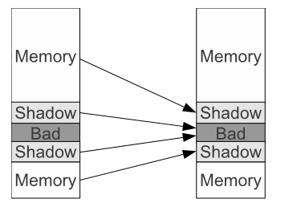

# AddressSanitizer


## 基本介绍

官网：[http://clang.llvm.org/docs/AddressSanitizer.html](http://clang.llvm.org/docs/AddressSanitizer.html)

源码：[https://github.com/google/sanitizers](https://github.com/google/sanitizers)

文档：[https://github.com/google/sanitizers/wiki/AddressSanitizer](https://github.com/google/sanitizers/wiki/AddressSanitizer)

## 支持

|               |      |        |      |       |      |        |         |           |
| ------------- | ---- | ------ | ---- | ----- | ---- | ------ | ------- | --------- |
| OS            | x86  | x86_64 | ARM  | ARM64 | MIPS | MIPS64 | PowerPC | PowerPC64 |
| Linux         | yes  | yes    |      |       | yes  | yes    | yes     | yes       |
| OS X          | yes  | yes    |      |       |      |        |         |           |
| iOS Simulator | yes  | yes    |      |       |      |        |         |           |
| FreeBSD       | yes  | yes    |      |       |      |        |         |           |
| Android       | yes  | yes    | yes  | yes   |      |        |         |           |

## 安装

```
llvm==3.4.2，yum -y install clang && yum -y install gcc gcc-c++ 
```

> GCC4.8之后直接提供了对这个工具的支持

## 使用

### 基本要求

1. llvm>3.1，clang编译
2. 编译时不允许使用-static参数（不支持静态链接）
3. 尽量不加-O2和-O1（实测检测会失效，具体项待验证）
4. Clang与gcc不能混用编译或链接

### 基本使用方法

#### 选项

* 用-fsanitize=address选项编译和链接你的程序;
* 用-fno-omit-frame-pointer编译，以在错误消息中添加更好的堆栈跟踪。
* 增加-O1以获得更好的性能。
* 避免使用 -Wl,-z,defs，因为可能会造成链接错误 
* 要获得完美的堆栈跟踪，您可能需要禁用内联(只使用-O1)和尾部调用消除(-fno-optimize-sibling-call)

#### 使用

简单内存检查使用(不包括检查内存泄漏)：

```sh
clang -O1 -g -fsanitize=address -fno-omit-frame-pointer {testfile.c} -o {testfile}
```

单独检查内存泄漏：

```shell
clang -O1 -g -fsanitize=leak -fno-omit-frame-pointer {testfile.c} -o {testfile}
```

检查内存错误和内存泄漏：

```shell
clang -fsanitize=address -g {testfile.c} - o {testfile} ; ASAN_OPTIONS=detect_leaks=1 ./testfile
```

最后执行程序

```shell
./testfile
```


### 检查的错误类型


## 原理

### 阴影内存

常见方法有两种：一种是直接将实际地址进行缩放+偏移映射到一个shadow地址，从而将整个的应用程序地址空间映射到一个shadow地址空间；一种是增加额外的地址转换表，通过查表完成实际地址到shadow地址的转换。比如Valgrind和Dr.Memory就是将shadow地址分成多个片段，然后通过查找表转换shadow地址。**而AddressSanitizer则采用了直接缩放+偏移的方式**。

> 典型的直接映射的方法包括**TraintTrace**和**LIFT**
>
> 使用多级翻译模式，例如Valgrind和DrMemory。将它们的影子内存分成几部分，并使用表查找来获得影子地址，需要额外的内存加载。
>
> Umbra结合了灵活的布局和高效性，避免了非均匀查表和动态缩放以及偏移模式
>
> Boundless将其某些元数据存储在64位指针的高16位中，但会在慢速路径上回退到更传统的影子内存。
>
> LBC使用存储在应用程序内存中的特殊值执行快速路径检查，并依赖慢速路径上的两级影子内存
>

**阴影内存映射**

假设应用程序内存地址为Addr，那么其对应的Shadow地址为(Addr>>3)+Offset。如果虚拟地址空间的最大合法地址为Max-1，那么Offset值的选择需要确保从Offset到Offset+Max/8在启动时不会被占用。对于常见的32位Linux和MacOS系统来说，其虚拟地址空间为0x00000000-0xffffffff，我们令Offset = 0x20000000 (2^29)。对于具有47个地址位的64位系统来说，我们令Offset =0x0000100000000000 (2^44)。

> Sanitizer维护程序的所有地址访问权限，用于判断内存访问是否合法。需要开辟一定的空间存储阴影内存。

注意到malloc函数的返回地址都是8字节对齐的, 所以对于heap上的8字节内存空间, 只有9种状态, 分别表示first k (0 <= k <= 8)是否可以访问, 而9种状态只需要1个字节就可以表示, 严格说1字节都用不着, 也就是说只使用1/8的虚拟地址空间的shadow memory就可以描述所有的地址。

阴影内存的地址的映射计算方法如下：

```
ShadowAddr = (Addr >> 3) + Offset
```

图示如下所示：




> - 因为shadow memory放在了中间, 所以用户的内存空间分成了上下2个部分
> - shadow memory本身也使用同样的映射算法, 但是shadow memory会映射到bad区域, 因为这是ASAN添加的内存区域, 程序是不能访问的
> - bad区域在页表中是禁止访问的

上面简单提过对齐的8字节有9种状态, 在ASAN的实现中采用如下编码:

- 0 - 该8字节均可访问
- k (1 <= k <= 7) - 前k个字节可访问
- negative - 该8字节均不可访问

负值表示所有8个字节都是不可访问的。同时我们采用不同的负值来标示不同类型的不可访问地址：

```
Heap left redzone: fa
Heap righ redzone: fb
Freed Heap region: fd
Stack left redzone: f1
Stack mid redzone: f2
Stack right redzone: f3
Stack partial redzone: f4
Stack after return: f5
Stack use after scope: f8
Global redzone: f9
Global init order: f6
Poisoned by user: f7
```


### 组成

> AddressSanitizer consists of two parts: an instrumentation module and a run-time library.

AddressSanitizer 包括两部分：指令模块和运行时库。

#### 代码插桩模块(instrumentation)

作用：代码插桩模块会对code进行修改以在每次内存访问时检查shadow state，同时负责在**栈和全局对象**周围创建用于检测overflow和underflow的poisoned redzones。

基于LLVM编译器指令集。

> 其他工具都不能发现栈溢出的错误。

**友商比较**

> Mudflap使用编译时检测因此能够检查对象的越界访问，但是因为对象之间没有插入红色区域，所以不能检查出所有的栈溢出bug
>
> CCured编译指令使用静态分析(仅C程序)消除多余的检查；它们的指令与非指令库不兼容。
>
> LBC使用源到源的转换和基于CCured去消除多余的检查。(仅限C语言和不能处理use-after-free)
>
> Insure++主要依靠编译时工具，但也使用二进制工具。实施细节尚未公开。

Mudflap就是采用的编译时代码插入技术，因此它可以检测到栈对象的越界访问。但是，由于它并没有在栈帧上的每个对象之间插入redzone，因此无法发现所有的栈缓冲区溢出bug，同时对于复杂C++代码还存在误报的问题。**AddressSanitizer采用了compile-time instrumentation，因此可以发现栈及global对象的相关越界访问。**

> 有了shadow memory之后, 还需要在访问内存的时候进行检查, 如果是已经编译好的二进制问题, 它是不知道shadow memory的, 所以这就需要在编译的时候插入相应的指令, 也就是说必须带上ASAN编译才能使用到这个功能.

ASAN的检查比较简单(意味着高效), 对于8字节内存访问只需要额外的一次内存访问:

访问8字节内存：

```c
byte *shadow_address = MemToShadow(address);
byte shadow_value = *shadow_address;
if (shadow_value) {
  if (SlowPathCheck(shadow_value, address, kAccessSize)) {
    ReportError(address, kAccessSize, kIsWrite);
  }
}
```

访问非8字节内存(1-, 2-, 4-byte的内存访问)：

```c
// Check the cases where we access first k bytes of the qword
// and these k bytes are unpoisoned.
bool SlowPathCheck(shadow_value, address, kAccessSize) {
  last_accessed_byte = (address & 7) + kAccessSize - 1;
  return (last_accessed_byte >= shadow_value);
}
```

这两种情况都是为原始代码中的每一次内存访问(读&写)增加了一次内存读。

>  这里需要注意的是, 对于unaligned access(不对齐的内存访问), ASAN有可能检查不出来.

错误报告代码(ReportAndCrash(Addr))最多只会被执行一次{!AddressSanitizer的机制是一旦检测到一个错误，就直接报告错误退出，这样做的理由是实现简单，也减少了记录所有错误的开销}，但是会被插入到代码的很多地方，因此需要确保它的紧凑性。


**如何检测栈区和全局对象？**

- 对于globals，在编译时创建redzones，在应用程序启动时将redzones的地址传递给运行时库。运行时库设置红区不可访问并且记录地址以进行进一步的错误报告。
- 对于栈对象，红区被创建和设置为不可访问在运行时。

例如给一个程序：

```c
void foo() {
  char a[10];
  <function body>
}
```

将被转换为：

```c
void foo() {
  char rz1[32]
  char arr[10];
  char rz2[32-10+32];
  unsigned *shadow =
  (unsigned*)(((long)rz1>>8)+Offset);
  // poison the redzones around arr.
  shadow[0] = 0xffffffff; // rz1
  shadow[1] = 0xffff0200; // arr and rz2
  shadow[2] = 0xffffffff; // rz2
  <function body>
  // un-poison all.
  shadow[0] = shadow[1] = shadow[2] = 0;
}
```


#### 运行时库(Run-time Libaray)

作用：替换malloc、free等相关的函数，并且在**堆区周围**创建用于检测的poisoned redzones，延迟已被free的堆空间的重用(正常情况下为提高内存使用率，已经被free的内存是可以被重用的，但是对于AddressSanitizer来说，因为要检查use-after-free错误，因此被free的空间会被放到一个队列中，这些来确保已被free的内存如果还会被使用的话能够被发现，当然该队列还是有一定的大小限制，按照FIFO的原则进行退出)，同时还会负责报告错误。

主要工作包括:

- 在程序启动的时候, 申请shadow memory的空间. 注意这里是虚拟地址空间, 并不是实际的物理内存,
- 设置bad区域为不可访问
- malloc/free的重新实现

其实通过shadow memory和instrumentation了, 我们已经可以检查出那些内存是可以访问的, 那么重新实现malloc/free的目的是什么?

- 首先, 合法访问不代表是正确的访问, 比如2次malloc返回连续的地址, 那么out-of-bounds就可能访问到另外一个合法的内存. 如果2次malloc的内存中间加上redzone, 那么就可以尽量抓住这种情况. redzone本身是不会被程序写坏的, 因为在写之前就已经发现这是一次非法访问了
- redzone可以用来记录一些额外的信息, 比如malloc的调用栈 (free的调用栈直接记录在内存区域)

另外, 如果free的内存重新被别人malloc了, 那么use-after-free, double free可能不能及时检查出来, 所以在free的时候尽量避免该内存重新被malloc出来.

> 从整体上看，AddressSanitizer采用的方法类似于基于Valgrind的工具AddrCheck：采用Shadow Memory来记录应用程序的每一字节是否可以安全地访问，同时采用代码插桩技术来针对应用的每次load和store对Shadow Memory进行检查。但是AddressSanitizer采用了一种更高效的Shadow映射方式，一种更紧致的Shadow编码技术，除了可以对堆进行检查外还可以检查栈和global对象，另外它要比AddrCheck快一个数量级。


## 精度与资源使用tunning

如下三个因素会影响AddressSanitizer的精度及资源使用，这三个值都是由环境变量控制，可以在程序启动时设置：

1)**Depth of stack unwinding (default: 30)**。对于每个malloc和free调用，该工具都会对调用栈进行unwind以为错误报告提供更多信息。该选项会影响工具的执行速度，尤其是对于那些属于malloc调用密集型的调用来说。它不会影响内存占用及查找bug的能力，但是调用栈太短的话不利于定位问题。

2)**Quarantine size (default: 256MB)**。即保存到前面提到的FIFO队列中的已free的内存空间大小之和，这个值会影响发现use-after-free类型bug的能力。但是它不影响性能。

3)**Size of the heap redzone (default: 128 bytes)**。该选项会影响发现堆异常类型bug的能力。该值越大，会导致性能变低并且占用更多内存，尤其是对那些进行了很多小块内存分配的程序来说。由于redzone会被用来保存malloc的调用栈，因此减少这个值，会导致最大unwinding深度变小。


## 优点和缺点

可以从多个方面看：

- 运行速度
- 内存消耗
- 支持的内存错误类型
- 发现错误的可能性(会不会误报)
- 支持的平台
- 其他的特性

### 优点

- 支持跨平台。

- 支持的错误报告类型多达21种。

- 平均速度为越来的73%,内存消耗大约3.4倍。速度和消耗都不错。

- 支持C与C++。

- 线程安全。

  因为它只会在应用程序内存数据不可访问时(在malloc和free内部，在栈帧被创建和销毁时，在模块初始化时)才会对它进行修改

### 缺点

- 漏报

  1. 那些产生局部越界的未对齐的内存访问。

     ```c
     int *a = new int[2]; // 8-aligned
     int *u = (int*)((char*)a + 6);
     *u = 1; // Access to range [6-9]
     ```

     根据前述的shadow计算方法，u这个地址会被左移3位，实际上得到的ShadowAddr与a没啥区别，这样k = *ShadowAddr;直接就是0，而不会报错。目前AddressSanitizer没有解决这个问题，因为目前能够想到的解决方案都会造成性能损失。

  2. 跳过redzone的越界访问。

     ```c
     char *a = new char[100];
     char *b = new char[1000];
     a[500] = 0; // may end up somewhere in b
     ```

     陷入到redzone的越界访问，100%会被检测到，但是如上的越界访问，可能刚好已经落到b分配的合法空间内了。如果内存充足，推荐采用128字节的redzone。

  3. 如果在free和下次use之间，又发生了大量内存的分配和释放，use-after-free错误可能无法被检测到。

     ```c
     char *a = new char[1 << 20]; // 1MB
     delete [] a; // <<< "free"
     char *b = new char[1 << 28]; // 256MB
     delete [] b; // drains the quarantine queue.
     char *c = new char[1 << 20]; // 1MB
     a[0] = 0; // "use". May land in ’c’
     ```

- 非期望的bug报告

  1. 与编译器的Load Widening发生冲突。

     ```c
     struct X { char a, b, c; };
     void foo() {
     X x; ...
     ... = x.a + x.c; }
     ```

     在该代码中，对象x是3字节大小，4字节对齐的。Load Widening会将x.a+x.c转换成一个4字节的load。按照之前的栈代码插入方式，第4个字节应该是被染毒的，这样在load这4个字节时，就会报错。通过在LLVM中临时关闭load widening解决。

  2. 与Clone冲突。

     首先进程，采用CLONE VM|CLONE FILES调用了clone，该操作会创建一个与父进程共享内存的子进程。特别是，子进程的栈使用的内存也是属于父进程的。然后子进程调用了一个包含栈上对象的函数，此时AddressSanitizer会将栈对象的redzone区域染毒。最后，子进程调用了一个不会return的函数(比如_exit或exec)，这样该函数对redzone进行消毒(un-poisoning)的那部分代码就不会被执行。这样父进程地址空间仍处于染毒状态，当该内存被再次使用时就会报错。我们通过找到所有的never-return函数(像_exit或exec这样具有该属性的那些函数)，然后在调用它们之前将整个栈内存消毒。与之类似，AddressSanitizer还必须要对longjmp和C++异常进行拦截。

- 不能执行过程添加，需要编译时期进行指定


## 更多工具

1. ThreadSanitizer

   ThreadSanitizer是一个用于C/C++和Go的快速数据竞争检测器。

2. MemorySanitizer

   一个快速的基于llvm的工具，用于检测未初始化内存的使用情况。

---

**参考链接**：

1. .[AddressSanitizer使用介绍](https://www.bynav.com/cn/resource/bywork/healthy-work/70.html)
2. https://github.com/google/sanitizers/wiki/AddressSanitizerLeakSanitizer#suppressions
3. 论文《AddressSanitizer: A Fast Address Sanity Checker》
4. https://zhuanlan.zhihu.com/p/95977383
5. https://zhuanlan.zhihu.com/p/338158556


